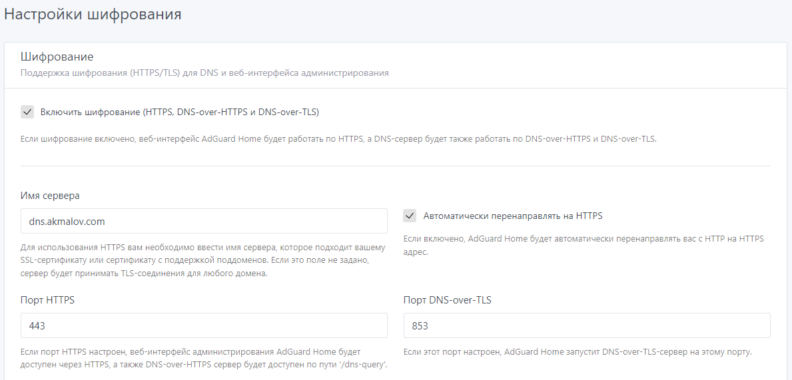
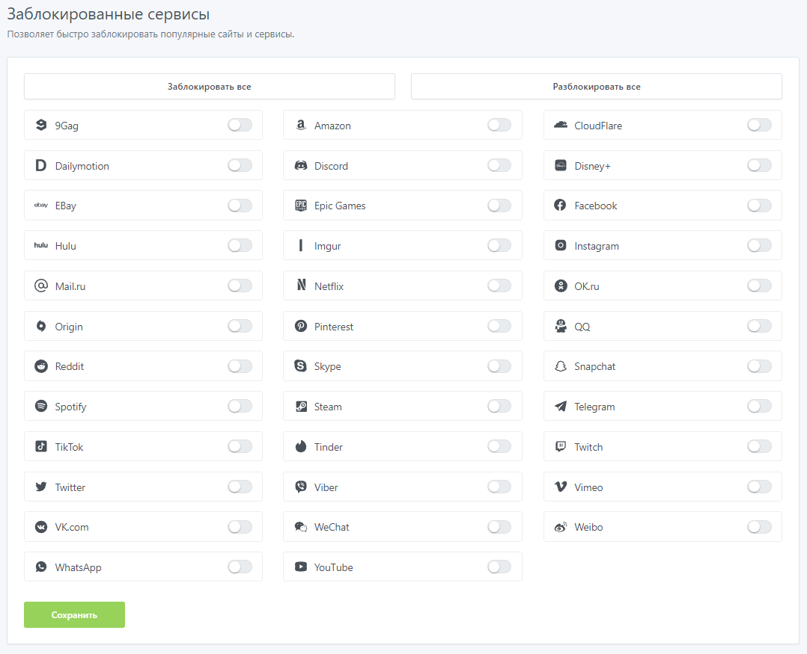

Простая установка и настройка домашнего DNS сервера с блокировкой рекламы и DOH (DNS over HTTPS)


[](/blog/adguard-home)


<!--truncate-->
## Adguard Home DNS сервер

**Adguard Home DNS** - [Github](https://github.com/AdguardTeam/AdGuardHome) Open Source проект с открытым исходным кодом, возможность использовать как DNS сервер, DHCP, блокировать часть рекламного контента,  устанавливать и настраивать различные фильтры.
В этой статье покажу установку с использованием docker-compose и настройку домашнего DNS сервера с блокировкой рекламы с использованием DoH (DNS-over-HTTPS). Можно использовать на виртуальной машине, отдельном сервере или на мини ПК например: Rasberry Pi


## 1. Подготовка среды

Буду устанавливать на LXC Proxmox
- OS: Ubuntu 22.02
- CPU: 2
- RAM: 1 Gb
- Disk: 10 Gb

Обновление пакетов и установка docker
```
apt update && apt upgrade -y
apt install -y curl
curl -fsSL https://get.docker.com -o get-docker.sh
sudo sh get-docker.sh
```


## 2. Настройка docker-compose.yaml

На официальной странице adguard home dns docker-hub приведен пример кода с docker run, но мне удобнее использовать docker compose
Команда для запуска docker
```
docker run --name adguardhome\
    --restart unless-stopped\
    -v /my/own/workdir:/opt/adguardhome/work\
    -v /my/own/confdir:/opt/adguardhome/conf\
    -p 53:53/tcp -p 53:53/udp\
    -p 67:67/udp -p 68:68/udp\
    -p 80:80/tcp -p 443:443/tcp -p 443:443/udp -p 3000:3000/tcp\
    -p 853:853/tcp\
    -p 784:784/udp -p 853:853/udp -p 8853:8853/udp\
    -p 5443:5443/tcp -p 5443:5443/udp\
    -d adguard/adguardhome
```
Описание используемых портов:
- `-p 53:53/tcp -p 53:53/udp`  - для работы DNS сервера.
- `-p 67:67/udp -p 68:68/tcp -p 68:68/udp` - для работы DHCP сервера
- `-p 80:80/tcp -p 443:443/tcp -p 443:443/udp -p 3000:3000/tcp` - для доступа к Web панели и работы в режиме HTTPS/DNS-over-HTTPS
- `-p 853:853/tcp `- для работы в режиме DNS-over-TLS
- `-p 784:784/udp -p 853:853/udp -p 8853:8853/udp` - для DNS-over-QUIC
- `-p 5443:5443/tcp -p 5443:5443/udp` - для DNSCrypt

Описание docker-compose.yml
```docker
version: "3.8"
services:
  adguardhome:
    image: adguard/adguardhome:latest
    hostname: adguard
    volumes:
      - ./adguard/work:/opt/adguardhome/work
      - ./adguard/conf:/opt/adguardhome/conf
    ports:
      - 53:53/tcp
      - 53:53/udp
      - 80:80/tcp
      - 443:443/tcp
      - 443:443/udp
      - 3000:3000/tcp
    restart: unless-stopped
```

т.к. не планируется использовать в качестве DHCP сервера, DNSoQUIC, DNSCrypt отключил проброс не нужных портов

Но при попытке поднять данный контейнер, возникает ошибка
> Error starting userland proxy: listen tcp4 0.0.0.0:53: bind: address already in use

Говорит о том что 53 порт уже используется системой, посмотрим кто его занял
```bash
lsof -i :53
```


*systemd-resolved занял 53 порт*

Редактирую файл, где установлю DNSStubListener = no
```
nano /etc/systemd/resolved.conf
```


```
[Resolve]
DNS=127.0.0.1
DNSStubListener=no
```

Сохраняю файл и перезапускаю службу
```bash
systemctl restart systemd-resolved.service
```

И можно запускать docker-compose

```bash
docker compose up -d
```

## 3. Настройка AdGuard Home

После успешного запуска контейнера, открываю Web интерфейс и продолжаю настройку
`http://YOUR-IP:3000/`


Далее установить логин и пароль, далее идет инструкция, жму готово. И перекидывает на основную панель.


На основном маршрутизаторе указываю IP этого хоста как основной DNS сервер
В целом можно уже в основных настройках DNS установить необходимый сервер, и начать пользоваться, далее необязательные настройки и дополнительные фичи.

### Черные списки DNS
Первым делом настраиваю черные списки DNS


Cсылки на URL DNS black-list, которые я использую:
- AdGuard DNS - `https://adguardteam.github.io/AdGuardSDNSFilter/Filters/filter.txt`
- AdAway Default Blocklist - `https://adaway.org/hosts.txt`
- MalwareDomainList.com - `https://www.malwaredomainlist.com/hostslist/hosts.txt`

В интернете так же можно найти более расширенные списки или добавить свои


### SSL сертификат
Настройки -> Настройки шифрования


### DNS-Over-HTTPS (DoH)


Настройки - Настройки DNS
DNS Upstream необходимо указать тип DNS over HTTPS, установил такие:
 - `https://dns.cloudflare.com/dns-query`
 - `https://dns-unfiltered.adguard.com/dns-query`

Если при нажатии **TEST Upstream** нет ошибок, значит все установлено правильно и можно проверять.


**Проверка DNS over HTTPS**

для этого использую сервис Cloudflare [1.1.1.1/help](https://1.1.1.1/help)


**Проверка DNS блокировка рекламы**

Для тестирования использую сервис [checkadblock.ru](https://checkadblock.ru/)

результаты блокировки рекламы

Но больше радует что в черные списки попадают сервисы сбора метрик и блокируется это наглядно можно увидеть в статистике главной панели


где видно как Яндекс Станция активно пытается отправлять метрики, но их блокирует DNS Server.


**Дополнительные настройки**

Так же можно тонко настраивать клиентов и распределять их по группам с разными правилами, ручные записи DNS, белые списки, блокировать контент 18+ и т.д.

**Блокировка сервисов**



Позволяет быстро заблокировать популярные сайты и сервисы.

## Итоги

Очень интересный проект, мне кажется на данный момент самый лучший DNS сервер для дома, так же лицензия позволяет устанавливать в школах и образовательных учреждениях (для блокировки доступа к запрещенному контенту) и коммерческих организациях (возможно актуально для малого офиса для блокировки рекламы и отвлекающих сервисов)
Простота установки и настройки, удобный интерфейс управления.
