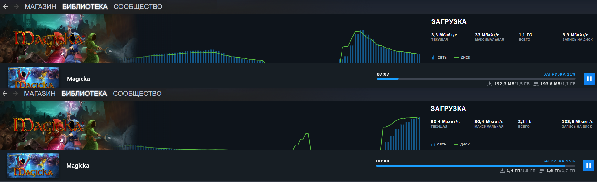
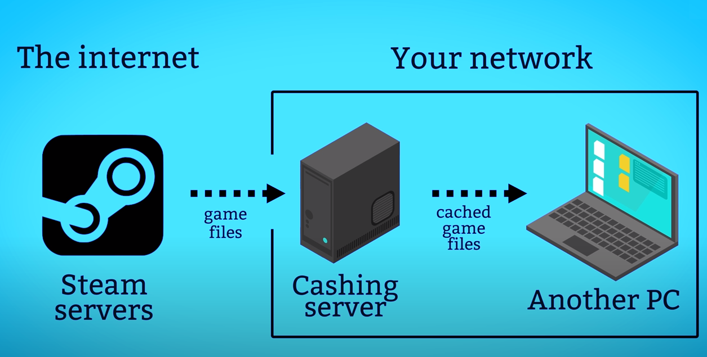

Сервер для компьютерного клуба. Cache Server позволяет разгрузить интернет канал и скачивать обновления по локальной сети

[](/blog/cache-server)
<!--truncate-->
## CACHE SERVER - Сервер кэширования
## Сервер для компьютерного клуба

## Введение

Один из компьютерных клубов просил помочь отладить сеть, так как появились жалобы от пользователей, что «тормозит интернет, пинги скачут, временами лагает». Было выявлено, что такие проблемы начинаются при большой нагрузке канала, при скачивании и обновлении игр. Более 30 компьютеров в клубе.

Установили основной маршрутизатор Mikrotik, настроили приоритизацию трафика, основная часть проблемы ушла.

Во время анализа сети, увидели, что большую часть трафика составляют обновления, которые каждый включенный компьютер начинает скачивать с интернета. Игр различных множество, многие обновления  имеют не маленький объем.

## Задача
Планировалось установить локальный сервер к которому компьютеры будут обращаться за обновлениями. Когда первый компьютер в сети скачает обновления, эти данные останутся на сервере. В дальнейшем другие компьютеры, которые планируют скачать те же самые файлы, получат их напрямую с сервера, значительно быстрее и не нагружая интернет канал.


## Реализация
### Оборудование

Буду использовать один из имеющихся обычных ПК в качестве сервера.

- CPU — Intel i3-10100
- RAM — 8Gb
- SSD 120 Gb — под ОС
- NVMe A-Data 1Tb — под кэш

Под кэш нужен быстрый NVMe диск, на надежность можно не обращать внимания т.к. никаких важных данных там не будет.

Так же обязательно наличие гигабитной сети в компьютерном клубе, иначе особо эффекта не будет. (1Gb порты на коммутаторах)

### Операционная система

Можно использовать любую ОС Linux которая по душе. Мне в плане администрирования удобнее сразу же накатить Proxmox, так же будет запас для будущих проектов.

### Linux Container
LXC контейнер для удобства установки. Ubuntu 21.04 template.

А внутри него уже докер

```
apt-get update && apt-get upgrade -y
apt-get install net-tools
apt-get install docker.io -y
apt-get install docker-compose

systemctl enable docker
systemctl start docker

reboot
systemctl status docker  
```

## CACHE SERVER
GAME CACHE SERVER

Есть готовый сервис для этих целей от [LANCACHE.NET](https://lancache.net/)
```
git clone https://github.com/lancachenet/docker-compose lancache
cd lancache
nano .env
```

Файл конфигурации


- LANCACHE_IP - aдрес LXC
- DNS_BIND_IP - aдрес LXC
- СACHE_DISK_SIZE - Размер диска под кэш 
- NVMe TZ (time zone) — Asia/Yekaterinburg
  

Запуск

```
docker-compose up -d
docker stats
```

Должно быть запущено 2 сервиса. DNS и Cache


## Тестирование

На компьютере в настройках IP адреса, редактирую DNS Server, меняю на адрес нашего LXC сервера.
Скачивание игры с любого ПК и пробую загрузить эту же игру с другого ПК.



Для наглядного сравнения.

- С интернета — 10 Мбайт/c (80 Мбит/c)
- С кэш сервера — 80 Мбайт/c (640 Мбит/c)


Здесь уже упираюсь в пропускную способность сети и дисков на ПК

Обновления до 1 Гб скачиваются по щелчку пальцев.

Заказчик доволен тесты прошли успешно.

## Итоги
По результатам кэш сервер для компьютерного клуба дает ощутимые результаты и сильно разгружает интернет канал.

Зачем скачивать одни и те же файлы с интернета если сервер может один раз скачать и поделится по локальной сети.




## P.S.

Статья старая, давно на деле не проверял, сам сервис тоже обновлялся поэтому лучше ориентироваться на [Github страницу](https://github.com/lancachenet/docker-compose) и инструкции на офф.сайте
