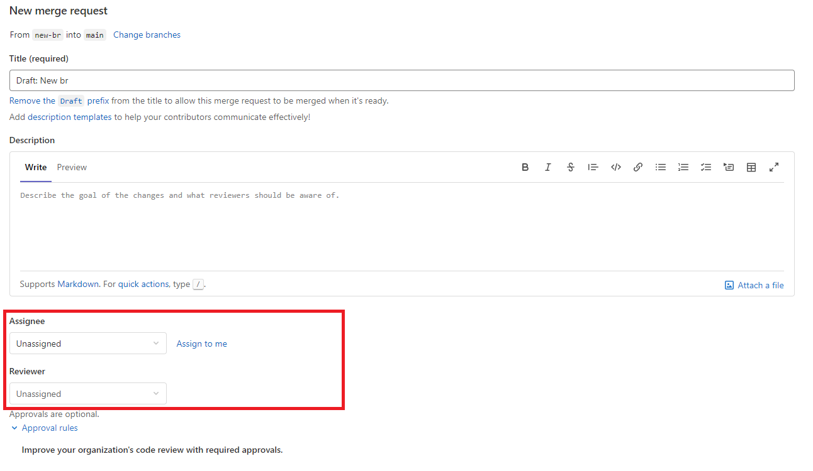

Gitlab auto assign reviewer — Автоматическое подставление assignee и reviewers при создании mergre request

[](/blog/gitlab-auto-reviewers)

<!--truncate-->
## Gitlab auto add reviewers

**Цель**: при создании Merge Request сделать удобное добавление ревьюверов





## 1. Reviewer templates

Первый способ который поможет в добавлении ревьюверов - это использование templates. Встроенная фича Gitlab, бесплатная для всех версий.

Документация - [Description templates](https://docs.gitlab.com/ee/user/project/description_templates.html)

### Подготовка
Нужно создать директорию ```.gitlab/merge_request_templates```

Создать внутри любой файл расширения ```.md```

Например ```top_reviewers.md```

С таким содержанием, где нужно добавить username ревьюверов:
```
/assign_reviewer @user1 @user2
```


### Использование

После добавления такого template, при создании новых MR появится дополнительное поле, где можно выбрать созданные шаблоны


Удобный способ, особенно если несколько разных групп ревбюверов, можно создавать несколько частых шаблонов и использовать их.

## 2. Bash gitlab API

Данный способ - добавление скрипта в ```.gitlab-ci.yml``` CI/CD, который позволит через API автоматический добавлять ревьюверов

### Подготовка

Для отслеживания создания merge request можно использовать разные события(триггеры):

- Gitlab CI workflow event
- Schedules
- Прочие события

Я буду использовать `workflow — merge request event`, для этого добавил в **workflow** триггер на создание MR:
```YAML
workflow:
  rules:
    - if: $CI_PIPELINE_SOURCE == "merge_request_event"
```

Переменные **Settings -> CI/CD -> Variables**
- `$TOKEN` - Gitlab API Token 

В gitlab runner где запускается pipeline нужен jq
Заранее установленый или доставить перед запуском скрипта:
```YAML
before_script:
  - apt-get install jq -y
```


### Скрипт

Пошаговая логика скрипта:

- Получить последний merge request ID
- Получить ID автора merge request
- Назначить Assigne = ID Автора
- Назначить Reviewers = из переменной  Reviewers(list)

```YAML
variables:
    PROJECT_URL: 'https://gitlab.com/api/v4/projects/$CI_PROJECT_ID/merge_requests'
    REVIEWERS: '10043654' # Reviewers Gitlab ID List

.gitlab_add_assignee_reviewers:
  stage: set up merge request
  script:
    - read LAST_MR_ID < <(curl --header "PRIVATE-TOKEN:$TOKEN" "$PROJECT_URL" | jq '.[0] | .iid')
    - read MR_AUTHOR < <(curl --header "PRIVATE-TOKEN:$TOKEN" "$PROJECT_URL/$LAST_MR_ID" | jq '.author | .id')
    # add assignee
    - curl -s --request PUT --header "PRIVATE-TOKEN:$TOKEN" "$PROJECT_URL/$LAST_MR_ID" --form "assignee_ids=$MR_AUTHOR" | jq '.assignees'
    # add reviewers
    - curl -s --request PUT --header "PRIVATE-TOKEN:$TOKEN" "$PROJECT_URL/$LAST_MR_ID" --form "reviewer_ids=$REVIEWERS"
```


## 3. Python gitlab API

Данный вариант более гибкий и удобный в плане доработок под разные условия.
Есть так же возможность вызывать как python script в ``gitlab-ci``

Полный код на github [https://github.com/akmalovaa/gitlab-auto-add-reviewers/tree/master/Python]

Python/settings.py
```Python
GITLAB_API_ADDR = '<https://gitlab.com>'      # Your Gitlab URL
GITLAB_TOKEN='YOUR GITLAB API TOKEN'        # API Token use import .env
GITLAB_ROOT_GROUP = ''                      # Root Group optional
GITLAB_REVIEWERS: list = [10043654]         # Gitlab Reviewrs ID
```

Python/main.py
```Python
import gitlab
import settings
import typing

gl = gitlab.Gitlab(settings.GITLAB_API_ADDR, private_token=settings.GITLAB_TOKEN)


def get_last_merge_requests() -> None:
    """ Get last merg request """
    if settings.GITLAB_ROOT_GROUP == '':
        all_mr: typing.Any = gl.mergerequests.list(state="opened")
    else:
        all_mr: typing.Any = gl.groups.get(settings.GITLAB_ROOT_GROUP).mergerequests.list(state="opened")
    try:
        last_mr: gitlab.v4.objects.merge_requests.MergeRequest = all_mr[0]
    except IndexError:
        print("Merge requests - Not found")
        return
    _auto_add_responsible(last_mr)


def _auto_add_responsible(mr: gitlab.v4.objects.merge_requests.GroupMergeRequest) -> None:
    project: gitlab.v4.objects.projects.Project = gl.projects.get(
        mr.project_id, lazy=True
    )
    editable_mr: gitlab.v4.objects.merge_requests.ProjectMergeRequest = (
        project.mergerequests.get(mr.iid, lazy=True)
    )
    editable_mr.assignee_id = mr.author["id"]
    editable_mr.reviewer_ids = settings.GITLAB_REVIEWERS
    print(editable_mr)
    editable_mr.save()


if __name__ == "__main__":
    get_last_merge_requests()
```

example for ```.gitlab-ci.yml```
```YAML
.python_add_reviewers:
  script:
    - pip install virtualenv
    - virtualenv venv
    - source venv/bin/activate
    - pip install -r Python/requirements.txt
    - python Python/main.py
```