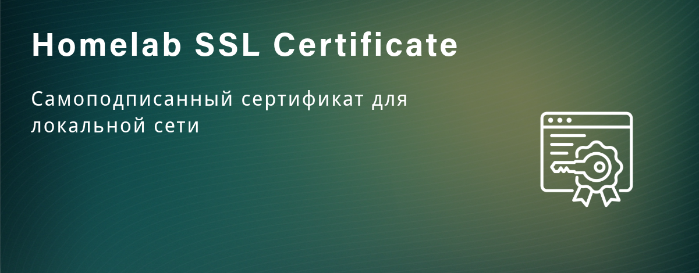

Создание самоподписанного SSL сертификата для локального использования

[](/blog/homelab-ssl-certificate)
<!--truncate-->

## Введение

Самый простой способ при наличии купленного доменного имени — получить wildcard сертификат от Let's Encrypt.

Если нет своего доменного имени, но требуется использовать поддомены с HTTPS в своей локальной сети, можно использовать самоподписанные сертификаты.

Стандартная схема цепочки сертификатов:

- Корневой сертификат (Root CA)
- Промежуточный сертификат (Intermediate CA)
- Сертификат для серверов (Server Certificate)

Для домашней локальной сети можно упростить схему и не использовать Intermediate CA.

Промежуточные сертификаты используются в крупных организациях для:

- 🏢 Разделения ответственности между отделами
- 🔒 Дополнительной безопасности (можно отозвать промежуточный CA, не затрагивая корневой)
- 📊 Управления большим количеством сертификатов
- 🌐 Коммерческих Certificate Authority

**План:**

- Создать корневой сертификат (Root CA)
- Создать wildcard сертификат для серверов (Server Certificate) и подписать его, используя Root CA

## Предварительные требования

:::info Необходимые инструменты

- OpenSSL (предустановлен в большинстве Linux/macOS систем)
- Текстовый редактор (nano, vim или любой другой)
- Базовые знания работы с терминалом
:::

## 1. Создание корневого сертификата (Root CA)

Создание ключа:

```bash
openssl genrsa -aes256 -out root.key 4096
```

Запросит пароль `Enter PEM pass phrase` — нужно его запомнить, он пригодится при подписании сертификата.

:::warning Важно
Закрытый ключ необходимо сохранить в надежном месте.
:::

Создание корневого сертификата (срок действия 20 лет):

```bash
openssl req -new -x509 -days 7200 -key root.key -sha256 -out root.pem
```

Команда запросит пароль, который вы придумали выше, и нужно будет заполнить поля. Обязательными являются только C (Country) и CN (Common Name):

```log
- Country Name (2 letter code) [XX]: RU
- State or Province Name (full name) []: Moscow
- Locality Name (eg, city) []: Moscow
- Organization Name (eg, company) [Internet Widgits Pty Ltd]: Homelab
- Organizational Unit Name (eg, section) []: IT
- Common Name (eg, fully qualified host name) []: *.akmalov.com
- Email Address []:
```

После создания проверьте содержимое сертификата:

```bash
openssl x509 -text -noout -in root.pem | head -15
```

Чтобы убедиться, что это центр сертификации, вы также можете ввести эту команду:

```bash
openssl x509 -text -noout -in root.pem  | grep CA:
```

Если `CA:TRUE`, значит все успешно, на выходе имеем два файла:

- root.key (закрытый ключ)
- root.pem (корневой сертификат)

:::info Установка сертификата
Файл `root.pem` нужно будет добавить на всех устройствах в доверенные корневые сертификаты.
:::

## 2. Создание ключа и подготовка конфигурации wildcard сертификата

Создание ключа:

```bash
openssl genrsa -out wildcard.akmalov.key 4096
```

Создание файла конфигурации:

```bash
nano wildcard.akmalov.cnf
```

Содержимое конфигурационного файла для wildcard сертификата `*.akmalov.com`:

```conf
[req]
distinguished_name = homelab
req_extensions = req_ext
prompt = no

[homelab]
C = RU
O = Wildcard Homelab
OU = IT
CN = *.akmalov.com

[req_ext]
keyUsage = keyEncipherment, dataEncipherment
extendedKeyUsage = serverAuth
subjectAltName = @alt_names

[alt_names]
DNS.1 = *.akmalov.com
```

## 3. Создание файла CSR

CSR (Certificate Signing Request) — запрос на подпись сертификата или, проще говоря, "заявление на сертификат".

Аналогия с паспортным столом:

1. Приватный ключ = ваша личность (секретная)
2. CSR = заявление в паспортный стол с вашими данными
3. CA (центр сертификации) = паспортный стол
4. Сертификат = готовый паспорт с печатью

Создание CSR с помощью ключа и конфигурационного файла:

```bash
openssl req -new -key wildcard.akmalov.key -config wildcard.akmalov.cnf -out wildcard.akmalov.csr
```

## 4. Подписание wildcard сертификата с помощью Root CA

Команда для подписания сертификата корневым центром сертификации:

```bash
openssl x509 -req -days 365 -in wildcard.akmalov.csr -CA root.pem -CAkey root.key \
    -CAcreateserial \
    -sha256 \
    -extensions req_ext \
    -extfile wildcard.akmalov.cnf \
    -out wildcard.akmalov.crt
```

:::info Пароль
Для подписания потребуется пароль от **Root CA** (который вы задали при его создании).
:::

Проверим, что сертификат правильный и цепочка доверия надёжная:

```bash
openssl verify -CAfile root.pem wildcard.akmalov.crt
```

:::success Результат
wildcard.akmalov.crt: OK
:::

Проверка базовой информации о сертификате:

```bash
openssl x509 -text -noout -in  wildcard.akmalov.crt  | head -15
```

Проверка DNS:

```bash
openssl x509 -text -noout -in  wildcard.akmalov.crt | grep DNS
```

## 5. Использование сертификата

Теперь есть пара сертификата и ключа:

- `wildcard.akmalov.crt` (сертификат)
- `wildcard.akmalov.key` (закрытый ключ)

Их можно использовать на proxy или напрямую в сервисах для любых доменов в зоне `*.akmalov.com`:

- test.akmalov.com
- grafana.akmalov.com
- api.akmalov.com
- и т.д.

### Итоги

Получали самоподписанный wildcard сертификат на 20 лет для своего домена, используя собственный корневой центр сертификации (CA). Для домашней лаборатории более чем.

Если необходимо более тонкая настройка и как то автоматизировать или упростить процесс создания и управления сертификатами, можно рассмотреть использование специализированных инструментов и серверов, таких как [smallstep/certificates](https://github.com/smallstep/certificates).

Для корректной работы нужно будет добавить `root.pem` на все домашние устройства:

- Windows
- Linux
- Android
- iOS

### macOS

```bash
sudo security add-trusted-cert -d -r trustRoot -k /Library/Keychains/System.keychain root.pem
```

### Linux (Ubuntu/Debian)

```bash
sudo cp root.pem /usr/local/share/ca-certificates/homelab-root.crt
sudo update-ca-certificates
```

### Windows

1. Откройте `root.pem` через двойной клик
2. Нажмите "Установить сертификат"
3. Выберите "Локальный компьютер" → "Доверенные корневые центры сертификации"

### Android/iOS

Перенесите файл на устройство и установите через настройки безопасности.

:::warning iPhone ограничения
iPhone перестали доверять сертификатам сроком более 365 дней. При выпуске wildcard сертификата выбирайте срок 365 дней и обновляйте ежегодно.
:::

## Итоги

Получили самоподписанный wildcard сертификат на 20 лет для своего домена, используя собственный корневой центр сертификации (CA). Для домашней лаборатории этого более чем достаточно.

Если необходима более тонкая настройка или нужно как-то автоматизировать процесс создания и управления сертификатами, можно рассмотреть использование специализированных инструментов, таких как [smallstep/certificates](https://github.com/smallstep/certificates) или [mkcert](https://github.com/FiloSottile/mkcert).

## Альтернативные решения

- **mkcert** — простой инструмент для создания локальных CA
- **step-ca** — полноценный Certificate Authority сервер
- **OpenSSL GUI** — графические интерфейсы для управления сертификатами
