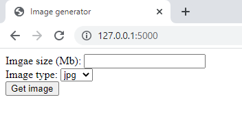
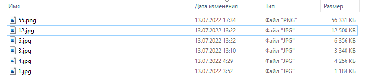
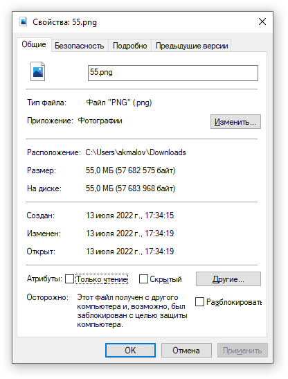

Image generator Python — простой сервис для создания (генерации) изображений необходимого размера веса

[](/blog/image-generator-python-flask-docker)

<!--truncate-->
## Image generator
Для тестирования одного приложения появилось потребность в изображениях разного веса (размера) от 1 до 120 Мб, искал различные генераторы изображений, ничего подходящего не обнаружил (только по разрешению и качеству при изменении которых не угадаешь какой размер получится на выходе — но можно конечно попробовать рассчитать)

Страница [Github](https://github.com/akmalovaa/image-generator)

## Принцип работы

- Ввод необходимого размер
- Выбор типа изображения (формат, расширение)
- Генерация изображения

Вроде все просто но на 3 пункте, немного подвис, если создавать изображения с помощью сторонних библиотек где можно задавать только высоту и ширину добиваясь этими параметрами нужных размеров файла было не удобно.

Решил немного схитрить, генерировать файл заполненный случайными данными нужного размера, архивировать его в zip и подсунуть как нагрузку к любому изображению

## Консольный вариант

В качестве шаблона изображения выбирает случайный файл в директории ./images
```python
import os.path
import zipfile
import random

def _get_image(extension) -> str:
    """Get random image from template desire extension (jpg, png)"""
    images: list = []
    for root, dirs, files in os.walk('images/'):
        for f in files:
            if f[-4:] == f'.{extension}':
                images.append(f)
    if images:
        return(f'images/{random.choice(images)}')
    else:
        print(f'No found template images')


def generate_image(size: int = 1, image_type: str = 'jpg') -> None:
    """ Generate binary file and create zip archive """
    if os.path.exists(f"generated/{size}.{image_type}"):
       return
    size_byte: int = size*1024*1024
    filename: str = 'workload.dat'
    generated_zip: str  = 'generated.zip'
    with open('%s'%filename, 'wb') as fout:
        fout.write(os.urandom(size_byte)) #1
    with zipfile.ZipFile(generated_zip, mode="w") as archive:
        archive.write(filename)
    os.remove(filename)
    """ Merge zip and jpg file """
    jpg_file = open(_get_image(image_type), 'rb')
    jpg_data = jpg_file.read()
    jpg_file.close()
    zip_file = open(generated_zip, 'rb')
    zip_data = zip_file.read()
    zip_file.close()
    # merge zip-jpg
    new_file = open(f'generated/{size}.{image_type}', 'wb')
    new_file.write(jpg_data)
    new_file.write(zip_data)
    new_file.close()
    # Remove generated zip
    os.remove(generated_zip)


if __name__ == '__main__':
    input_size = input ("Enter the desired image size (Mb): ")
    try:
        image_size = int(input_size)
    except ValueError:
        print("Not interesting value, need number(int)")
    if image_size > 0 and image_size < 1000:
        generate_image(image_size)
    else:
        print('Sorry, dont want to do this') 
```

## Web версия

Использовал Flask + Bootstrap для оформления.

Ранее не приходилось делать веб скрипты, появилось желание посмотреть и попробовать.

Цели:

- Поле ввода размера файла в Mb (только цифры от 1 до 999)
- Выпадающий список формата файлов
- Кнопка

Так выглядит без оформления:



С использованием стилей Bootstrap:


## Контейнеризация
Ну и чтоб удобнее было использовать собрать все это в docker

Dockerfile:
```
FROM python:3.10.5-slim-buster

RUN apt update && apt upgrade -y && pip install poetry

WORKDIR /image-generator

COPY . .

RUN poetry config virtualenvs.create false
RUN poetry install
```


Для удобства запуска docker-compose

```yaml
docker-compose.yml:
version: '3.7'

services:
  app:
    build: ./
    image: image-generator
    ports:
      - 80:80
    command: "python app.py"
    volumes:
      - ./images:/images
      - ./generated:/generated
```


## Запуск

На сервере или VM с установленным docker, docker-compose
```bash
git clone https://github.com/akmalovaa/image-generator.git .
docker-compose up -d --build
```

## Заключение

Еще много всего можно доработать, и возможно лучше брать реальный расчет и генерировать нормальные изображения.

Цель достигнута познакомился с Flask скрипт работает, быстро и удобно разворачивается






Файлы открываются в Windows, Photoshop и WinRAR

Если изменить изображение в редакторе и сохранить нагрузочный архив исчезнет и картинка станет оригинального размера.
