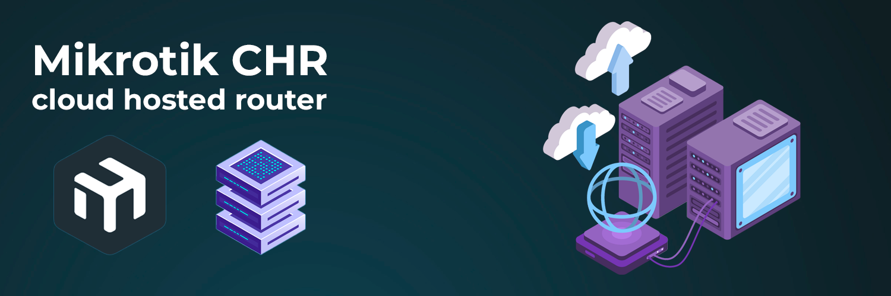
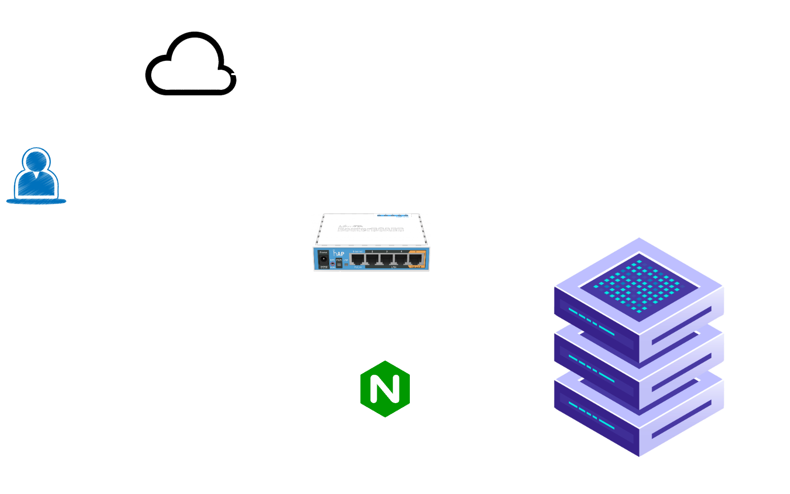
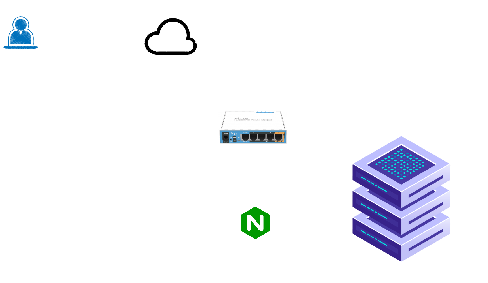
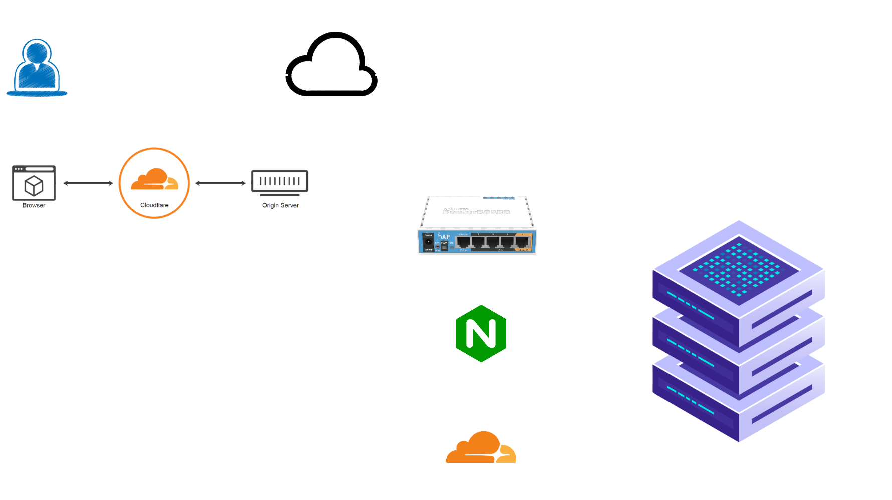
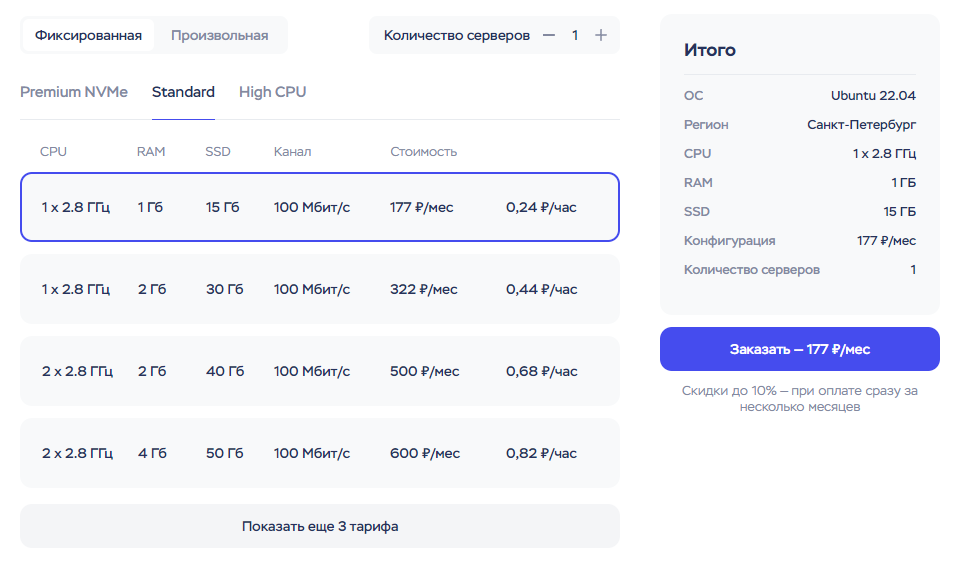
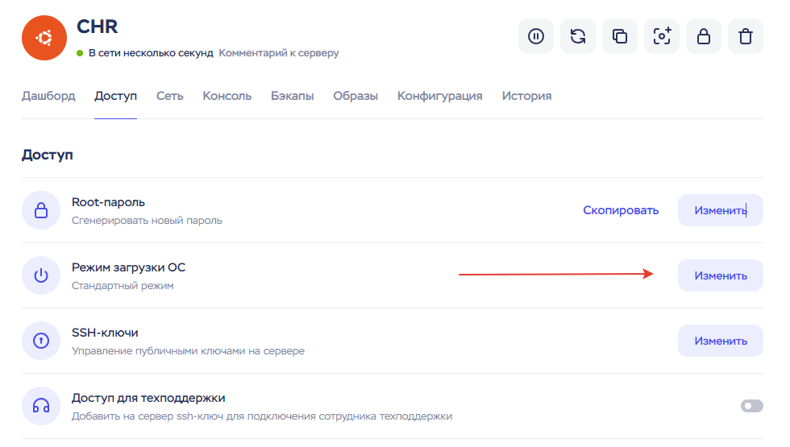
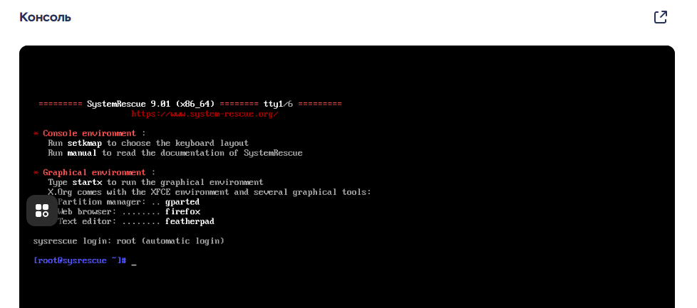
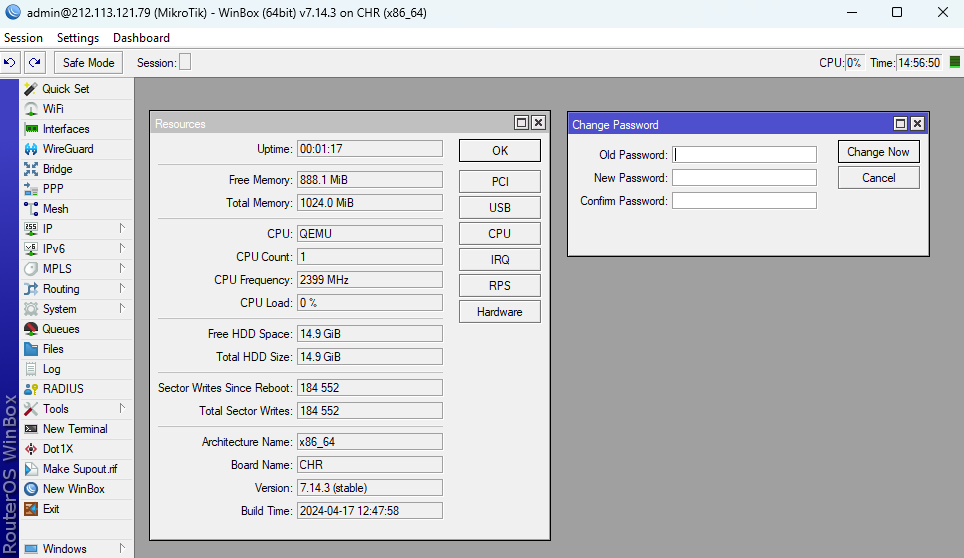
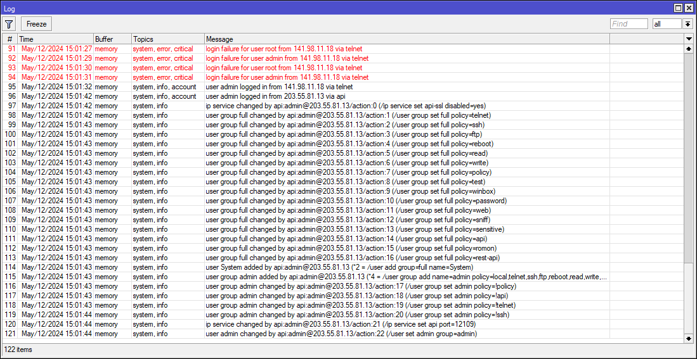
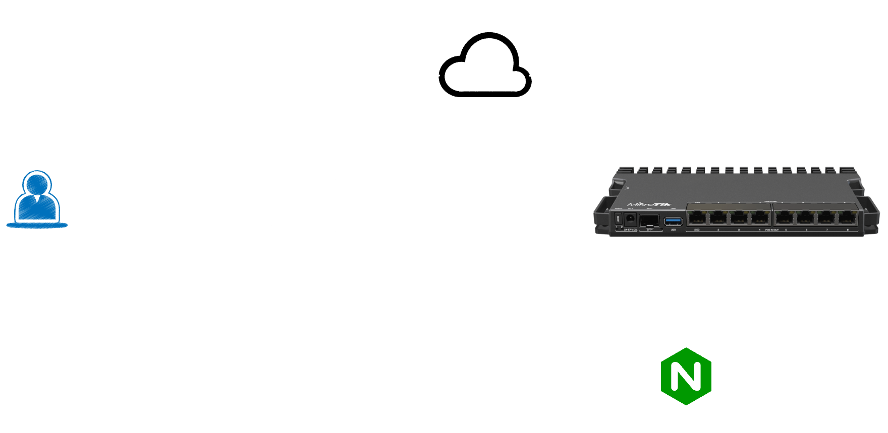

Установка Mikrotik Cloud Hosted Router на облачный сервер и для чего я его использую

[](/blog/mikrotik-chr)
<!--truncate-->

## Введение 

MikroTik Cloud Hosted Router (CHR) — специальная версия RouterOS, для работы в качестве виртуальной машины. Поддерживает архитектуру x86-64-разрядную и может использоваться на большинстве популярных гипервизоров, таких как VMware, Hyper-V, VirtualBox, KVM и т.д. 

Системные требования CHR:

- **CPU:** 64-bit with virtualization support
- **RAM:** > 256MB
- **Disk:** > 128MB (Max: 16GB)


По умолчанию в CHR включены все функции RouterOS, но немного отличается модель лицензирования. Ограничения лицензии это скорость интерфейса наружу - 1 Мбит в бесплатной версии. 

**Лицензии**

| Название | Скорость | Цена       |
|----------|----------|------------|
| Free     | 1 Mbit   | Бесплатно  |
| P1       | 1 Gbit   | $45        |
| P10      | 10 Gbit  | $95        |

Управлять лицензиями можно в личном кабинете на официальном сайте mikrotik.com

На Avito или специализированных группах telegram можно найти от 1000 рублей за P1


## Для чего использую Mikrotik CHR в облаке

Как внешний узел для распределения трафика

### Стандартная схема

Интернет + статичный белый IP адрес от провайдера приходит сразу на роутер, все в дом, а дальше трафик распределяется внутри

[](./scheme1.excalidraw.png)

**Плюсы:**
- Нет никаких зависимых сервисов, провайдер направляет весь трафик напрямую на мое устройство

**Минусы:**
- Цена 250 рублей в месяц за белый IP адрес
- В случаи проблем со стороны провайдера, я завязан на выданный IP адрес и резервные интернет каналы не спасут от недоступности сервисов


### Схема c использованием Cloud Hosted Router

Поднять RouterOS на облачном сервере, настроить VPN + IPsec сервер

Настроить подключение к домашней сети и распределение трафика

[](./scheme_chr.excalidraw.png)

**Плюсы:**
- Цена VPS + статичный белый IP, дешевле чем просто IP адрес у моего провайдера, на timeweb сервер с `1 CPU, 1Gb RAM, 15GB NVMe` (таких ресурсов для роутера хватит с большим запасом) вышло 177 ₽/мес
- Можно спокойно менять провайдера, поднимать резервные каналы связи
- Еще одна ступень защиты (при грамотной настройке Firewall)
- Остаются свободные ресурсы на сервере, можно еще что-то полезное поднять

**Минусы:**
- Появляется еще одна сетевая точка отказа


### Схема c использованием Cloudflare tunnel

Еще один вариант, DNS провайдер Cloudflare предоставляет возможность вообще не использовать белые IP адреса

Если доменное имя привязано к Cloudflare, можно использовать `Cloudflare Zero Trust` и внутри своего контура поднять сервис(службу) который будет поддерживать зашифрованный тунель с Cloudflare и перенаправлять домены на нужные адреса, берет на себя даже роль прокси сервера. 


[](./scheme_cloudflare.excalidraw.png)

Плюсы:
- Полностью бесплатна
- Дополнительная защита от DDoS
- Можно не использовать свой proxy сервер (для простых проектов)
- Отсутствие привязки к IP адресам
- Автоматическое использование SSL сертификата

Минусы:
- Поднимать в своем контуре непонятный сервис и весь трафик гонять через него


## Установка MikroTik CHR в облаке

В качестве примера буду использовать облака от [timeweb](https://timeweb.cloud/r/cp14436)

Создаю сервер **Ubuntu** и минимальными ресурсами

[](./chr_cloud_create.png)

На созданном сервере поменять режим загрузки ОС для того, чтобы полностью остановить запись на диск `/dev/vda`

[](./chr_cloud_create2.png)

**Режим загрузки ОС**

**Выбрать тип:** Загрузка с диска восстановления 

Консоль SystemRescue (**Ctrl + V** работает)

[](./chr_install.png)


На официальном сайте [Mikrotik Software](https://mikrotik.com/download)

Найти последнюю стабильную версию Cloud Hosted Router - `Raw disk image` и скопировать ссылку, вставить в терминале сервера восстановления (wget для скачивания образа)

```shell
wget https://download.mikrotik.com/routeros/7.14.3/chr-7.14.3.img.zip
```

Разархивировать образ:
```shell
unzip chr-7.14.3.img.zip
```

Записать на диск `/dev/vda`:
```shell
dd if=chr-7.14.3.img of=/dev/vda
```

Вернуть серверу стандартный режим загрузки и перезагрузить.

Для проверки подключиться с терминала или c winbox, пользователь `admin` пароль пустой. 

:::danger Важно
Нужно сразу сменить пароль, иначе быстро придут боты, сами поменяют и настроят
:::

[](./chr_winbox.png)

> Логи: что будет если медлить с паролем или установить простой

Быстро подберут пароль, добавят своего пользователя, включат все сервисы для подключения, admin-скую сместят в правах и добавят данное устройства в сеть автоботов для восстания машин

[](./chr_hacked.png)

Идет постоянное сканирование портов: `22,23,8291,8022,8728,8729`


## Настройка CHR

Первым делом базовые настройки безопасности

Чек лист:
- Создать нового пользователя с полными правами, `admin` отключить | удалить
- Отключить лишние сервисы и поменять стандартные порты
- Настроить Firewall
- Отключить mac-telnet, neighbors
- Настроить Firewall IPv6 если нужно, иначе просто отключить IPv6
- Опционально: *Port Knocking*

### VPN

Этот облачный роутер настрою как центральный хаб, через который будет осуществляться подключение к домашней сети с различных устройств и внешний доступ к моим сервисам по https

Для подключения будет использоваться связка IPSec/L2TP. Настройки подробно описывать не буду, есть уже много готовых инструкций.

Когда **Reverse Proxy Server** находится в домашней сети, предстоит повозиться с машрутами т.к. по умолчанию обратные машруты **nginx** попытаются пойти через домашний маршрут в интернет

[](./chr.excalidraw.png)

Добавляю дополнительную таблицу маршрутизации `chr` на домашнем роутере
```shell
/ip route
add dst-address=0.0.0.0/0 gateway=l2tp routing-table=chr
```

маркировка коннектов и трафика
```shell
add action=mark-connection chain=prerouting in-interface=l2tp new-connection-mark=chr-conn passthrough=yes
add action=mark-routing chain=prerouting connection-mark=chr-conn new-routing-mark=chr-route passthrough=yes
```

- Если трафик пришел через l2tp туннель, помечаем соединение его как `chr-conn`
- Если видим помеченное соединение `chr-conn`, то добавляем маркировку трафика `chr-route`

Добавляю правило для `chr-route`, поменять таблицу маршрутизации на `chr`
```
/routing rule
add action=lookup-only-in-table disabled=no routing-mark=chr-route table=chr
```

Как вариант можно поднять **Reverse Proxy** [Nginx на самом Mikrotik CHR ](https://akmalov.com/blog/mikrotik-nginx). Ресурсы на VPS позволяют это спокойно сделать.

Данный способ выглядит еще интереснее и не нужно будет с маршрутами возится.

В целом все.

Пытался показать для чего я использую RouterOS CHR и как просто развернуть его в облаке.