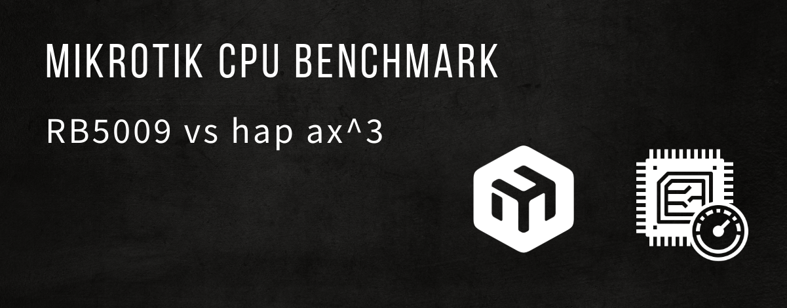

CPU benchmark ipq-6010 vs 88f7040 сравнение производительности устройств MikroTik RB5009 vs hap ax3

[](/blog/mikrotik-cpu-benchmark)
<!--truncate-->

## Введение

Возможность запускать контейнеры прямо на маршрутизаторах MikroTik открывает большие возможности, теперь ограничения только в фантазии и ресурсах железки

Если решите поиграть дома с контейнерами, то советую выбирать устройства:
- **ARM64**
- **RAM** > 1Gb

или использовать **CHR VM**

На данный момент 2025 год и самые доступные для развлечений с контейнерами реальные железки это:
- hap ax2 (нет USB порта придется использовать сетевой диск)
- hap ax3
- RB5009

По основным характеристикам все предлагаемые модели схожи, но имеют разные процессоры и хотелось бы сравнить их производительность (hap ax2 не смогу протестировать, данной модели нет под рукой, но и процессор там аналогичный ax3 - IPQ-6010)

## Сравнение CPU MikroTik

| Property | RB5009UG | HAP AX^3 | HAP AX^2 |
|---|---|---|---|
| **Product code** | RB5009UG+S+IN | C53UiG+5HPaxD2HPaxD | C52iG-5HaxD2HaxD-TC |
| **Architecture** | ARM 64bit | ARM 64bit | ARM 64bit |
| **CPU** | 88F7040 | IPQ-6010 | IPQ-6010 |
| **CPU core count** | 4 | 4 | 4 |
| **CPU nominal frequency** | 350-1400 MHz | 864 - 1800 MHz | 864 - 1800 MHz |
| **Size of RAM** | 1 GB | 1 GB | 1 GB |
| **Storage size** | 1 GB | 128 MB | 128 MB |
| **IPsec hardware acceleration** | Yes | Yes | Yes |
| **Suggested price** | $219.00 | $139.00 | $99.00 |


Для тестирования производительности CPU буду использовать контейнер с sysbench

```bash
docker run --rm zyclonite/sysbench --test=cpu run
docker run --rm zyclonite/sysbench --test=cpu --threads=4 run
```

Установлена последняя версия на текущий момент: `RouterOS 7.19.3`

Сначало проверим включен ли режим контейнеров
```routeros
/system/device-mode/print 
```

Если нет, то включаем
```routeros
/system/device-mode/update container=yes
```

Краткая инструкция по настройке
```routeros
# Create bridge for containers
/interface/bridge/add name=br-container 
/ip/address/add address=10.200.0.1/24 interface=br-container 
# Virtual Ethernet interface for Docker containers
/interface/veth/add name=veth1 address=10.200.0.10/24 gateway=10.200.0.1 
/interface/bridge/port/add bridge=br-container interface=veth1 
```

Cоздаем контейнер с sysbench
```routeros
/container/add remote-image=mirror.gcr.io/zyclonite/sysbench cmd="--test=cpu --threads=1 run" interface=veth1 logging=yes name=sysbench root-dir=docker/sysbench 
```

Далее запускаем контейнер и смотрим результаты в логах

### RB5009 - CPU 88F7040

[](./image-5009.png)

sysbench
```log
threads: 1
sysbench: CPU speed: 1276 events per second
```
```log
threads: 4
sysbench: CPU speed: 5093.27 events per second
```

[](./cpu-5009.png)

### HAP AX3 - CPU IPQ-6010

[](./image-hap-ax3.png)
sysbench
```log
threads: 1
sysbench: CPU speed: 841 events per second
```
```log
threads: 4
sysbench: CPU speed: 3347.89 events per second
```

[](./cpu-hap-ax3.png)

### CHR VPS Red Hat KVM x86_64

Есть старая дешевая VPS от облачного провайдера, где запущен CHR много лет назад, до сих пор без проблем и сбоев работает, решил протестировать и ее тоже

**CPU:** 1 core 2194 MHz  
**RAM:** 1 GB

```log
threads: 1
sysbench: CPU speed: 753.14 events per second
```
```log
threads: 4
sysbench: CPU speed: 748.89 events per second
```

## Сравнение производительности CPU (одноядерный режим)

| Device | CPU | Frequency | Events/sec | Relative performance |
|---|---|---|---|---|
| **RB5009UG+S+IN** | 88F7040 | 350-1400 MHz | **1276** | 100% |
| **HAP AX3** | IPQ-6010 | 864-1800 MHz | **841** | 66% |
| **CHR VPS (KVM)** | x86_64 | 2194 MHz | **753** | 59% |


```
RB5009 (88F7040)    ████████████████████    1276 events/sec
HAP AX3 (IPQ-6010)  █████████████▎          841 events/sec
CHR VPS (x86_64)    ████████████            753 events/sec
```

## Сравнение производительности CPU (многоядерный режим, 4 потока)

| Device | CPU | Threads | Events/sec | Relative performance |
|---|---|---|---|---|
| **RB5009UG+S+IN** | 88F7040 | 4 | **5093.27** | 100% |
| **HAP AX3** | IPQ-6010 | 4 | **3347.89** | 66% |
| **CHR VPS (KVM)** | x86_64 | 4 | **748.89** | 15% |


```
RB5009 (88F7040)    ████████████████████    5093 events/sec
HAP AX3 (IPQ-6010)  █████████████▎          3348 events/sec
CHR VPS (x86_64)    ███                     749 events/sec
```

## Выводы


### RB5009 (88F7040)
Лидерует, производительность выше чем HAP AX3 на 52%, но и цена дороже на 58%

### HAP AX3 (IPQ-6010)
Достойный результат, хорошее соотношение цена/производительность

### HAP AX2 (IPQ-6010)
Если учитывать что у модели hap ax2 процессор аналогичный

Лучшее соотношение цена/производительность, но нужно помнить что нет USB порта, для работы с контейнерами придется настраивать отдельное сетевое хранилище 

### CHR VPS (x86_64)

Не ожидал такой низкой производительности. Самый дешевый VPS 1 core 1 GB RAM, результаты оказалось ниже чем на маршрутизаторе. Тут уже больше зависит от честности самого облачного провайдера.

Попробовал запустить CHR VM на своем Proxmox **AMD Ryzen 7 8745H**

**CPU speed:** 5328.60

Получается мой VPS провайдер что то мутит или я сам в настройках что то упустил. Надо будет проверить подробнее на разных провайдерах.

### О контейнерах
Больше информации на сайте MikroTik о контейнерах и их настройке [Container on MikroTik](https://help.mikrotik.com/docs/spaces/ROS/pages/84901929/Container)

Ролик на YouTube - [Docker в Mikrotik](https://www.youtube.com/watch?v=gfM1FvrWN18)

В целом начало уже положено, использовал чтоб поднять реверс прокси nginx и свои проекты для расширения возможностей маршрутизатора, работает стабильно.

На более ранних устройствах с 512Mb RAM и старыми версиями ARM не рекомендую, т.к. могут быть проблемы с памятью и производительностью и сборками. Пробовал на разных старых роутерах баловаться, есть нюансы и не все работает стабильно и предсказуемо.


## sysbench
Для сравенения другие устройства в `sysbench` threads=1

```bash
docker run --rm zyclonite/sysbench --test=cpu --threads=1 run
```

```
- Intel N100:            2951.01
- AMD Ryzen 5 5600G:     4711.98
- AMD Ryzen 7 8745H:     5390.37
- Apple Mac Mini M4 16:  10459.80
```

