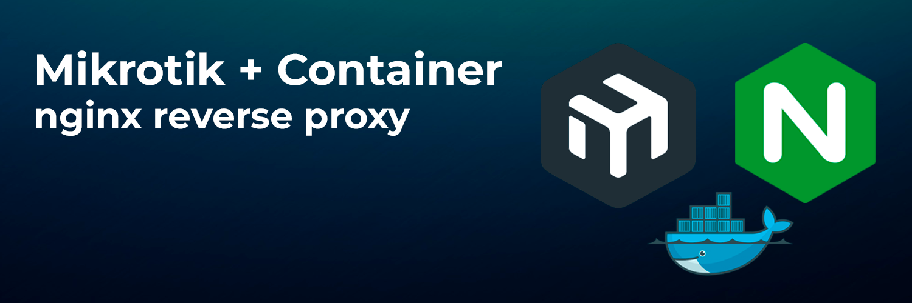
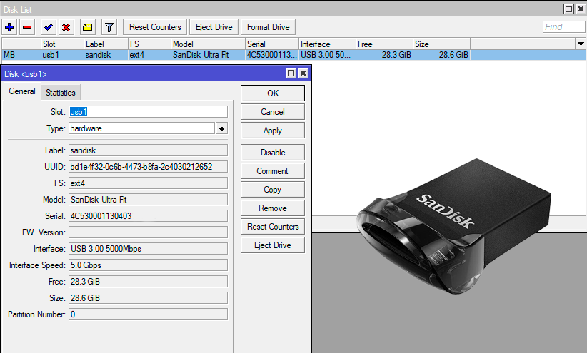
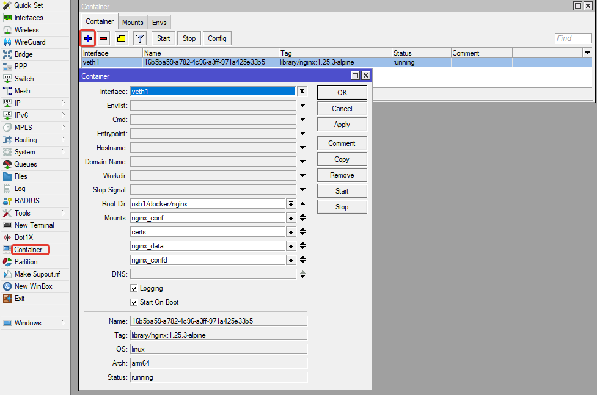

Mikrotik запустить NGINX Reverse Proxy как контейнер в роутере

[](/blog/mikrotik-nginx)
<!--truncate-->

## Введение 
## О контейнерах в Router OS

Начиная с RouterOS v7.4 и выше, в mikrotik подвезли такую штуку как **Container**, работает на устройствах **arm, arm64, x86**

Страница с описанием и примерами настроек на wiki [help.mikrotik.com](https://help.mikrotik.com/docs/display/ROS/Container)

Мне очень нравятся контейнеры, люблю Docker и с такой фичей возможности домашнего роутера теперь ограничиваются только фантазией и ресурсами

Про ресурсы, для тестов имеется устройство Mikrotik hap ax3 (C53UiG+5HPaxD2HPaxD) [спецификация](https://mikrotik.com/product/hap_ax3):
- **Architecture:**	ARM 64bit
- **CPU:** IPQ-6010, 4 core, (864 - 1800) MHz
- **Size of RAM:** 1 GB
- **Storage size:**	128 MB

В целом 1Gb (из них свободно примерно 650Mb) не так и много на сегодня, что же можно там поднять? На сайте wiki разработчики показывают примеры с
- PiHole (DNS Server с возможностями блокировки рекламы) мне больше нравится его аналог AdguardHome
- freeradius server - не знаю, насколько актуален сегодня radius server
- mosquitto MQTT - Message Queuing Telemetry Transport (MQTT) Protocol. Для интернета вещей
- ThingsBoard MQTT/HTTP server - еще одна платформа для интернета вещей

:::tip Совет с официального сайта
Внедрение функции контейнера в RouterOS позволило запускать серверы для выполнения всевозможных задач внутри маршрутизатора. Это особенно актуально для людей, которые хотят уменьшить количество устройств в своей сети. 
Вместо того, чтобы запускать сервер на отдельном устройстве/машине, почему бы не запустить его внутри маршрутизатора?
[](./farcry.png)
:::

## RouterOS nginx reverse proxy

На данный момент в качестве прокси сервера стоит отдельная виртуальная машина, на котором пробовал различные инструменты (nginx, traefik, caddy)

Попробую перенести и запустить это внутри маршрутизатора, выбрал **nginx** т.к. по ресурсам RAM, он потребляем меньше всего

### Подготовка

Функция **container** по умолчанию отключена, нужен физический доступ к маршрутизатору для включения

:::warning Disclaimer
- Запуск образа контейнера на вашем маршрутизаторе может открыть брешь в системе безопасности
- Если маршрутизатор взломан, контейнеры могут быть использованы для простой установки вредоносного программного обеспечения на ваш маршрутизатор и по сети
:::

Разработчики настаивают на использовании внешненго накопителя (usb, ssd), чтобы не насиловать файловую систему самого роутера. Установил туда небольшого размера флешку на 32Gb


[](./mikrotik-usb.jpg)

Имеется поддержка USB 3.0

[](./mikrotik-usb-disk.png)

**RouterOS**

1. Необходимо скачать [**Extra packages** с официального сайта](https://mikrotik.com/download) выбрав нужную архитектуру 
В архиве несколько разных расширений, пример названия - `container-7.xx.x-arm64.npk`. Установить и перезагрузить

2. В терминале выполнить команду для включения функции **Container**
```
/system/device-mode/update container=yes
```

После этого в терминале напишет сообщение, что нужно подтвердить нажатием кнопки сброса или перезагрузкой по питанию

### Запуск nginx container

Добавить виртуальный интерфейс 
```
/interface/veth/add name=veth1 address=172.17.0.2/24 gateway=172.17.0.1
```
Если нужно настроить для этого адреса NAT, добавить в bridge, проверить правила firewall


Настройка конфигурации **container**
```
/container/config/set ram-high=200 registry-url=https://registry-1.docker.io tmpdir=usb1/tm
```
[](./routeros-container-config.png)

**RAM Hight** - Ограничение использования оперативной памяти (по умолчанию без лимита, рекомендую указать)


**Mount Points**

Точки монтирования зависят от конфигурации которую планируется использовать. 

>Свою конфигурацию NGINX [прикладываю на Github](https://github.com/akmalovaa/mikrotik-nginx)

Структура каталогов:
[](./nginx-dir.png)

В моей конфигурации для упрощения все хосты находятся в отдельных файлах
`config/proxy_host/*.conf`. Удобно при добавлении/удалении новых хостов - просто скопировать файл и изменить адрес, порт, домен (для отключения просто удалить файл). Остальные файлы конфигурации при этом можно вообще не трогать.

```
/container/mounts/add dst=/etc/nginx/nginx.conf name=nginx_conf src=/usb1/nginx/nginx.conf
/container/mounts/add dst=/etc/nginx/certs name=certs src=/usb1/nginx/certs
/container/mounts/add dst=/data name=nginx_data src=/usb1/nginx/data
/container/mounts/add dst=/etc/nginx/conf.d name=nginx_confd src=/usb1/nginx/config
```

:::tip Работа с файлами
Для удобства конфигурации и работы с файлами можно включить **IP -> SMB** и расшарить USB по сети 
:::


Буду использовать [nginx alpine с docker hub](https://hub.docker.com/_/nginx) 
На сегодня последняя версия это `nginx:1.25.3-alpine`

```
/container/add remote-image=nginx:1.25.3-alpine interface=veth1 root-dir=usb1/docker/nginx mounts=nginx_conf,nginx_confd,nginx_data,certs
``` 

Указать образ, виртуальный интерфейс, монтируемые директории, 
[](./mikrotik-container.png)

Дополнительные возможности:
- передать ENV переменные 
- запускать контейнер при включении роутера 
- переопределять CMD и Entrypoint
- и т.д.

**root-dir** - используется как изолированная файловая система для контейнера (в docker **var/lib/docker/volume**)

## Итоги

### nginx container
NGINX запущен и работает, конфигурацию менять не очень удобно, как вариант можно использовать **Nginx Proxy Manager**

**Nginx Proxy Manager** - opensource проект, где в одном контейнере web-gui, db, nginx, certbot (и даже API для конфигурации)

- [Github проекта](https://github.com/NginxProxyManager/nginx-proxy-manager)
- [Статья](https://akmalov.com/blog/nginx-proxy-manager)

но, он использует гораздо больше **RAM** если на 1Gb запускать только его - думаю потянет.

Есть мысли как даже с минимальным nginx сделать удобнее изменение конфигурации, но пока ничего не сделано


### container stats
На данный момент нет возможности удобно смотреть в mikrotik сколько ресурсов использует тот или иной контейнер, не очень удобно


### что еще позапускать

- AdguardHome - можно, не особо требователен к ресурсам
- Home Assistant - не хватит ресурсов
- Альетрнативные reverse proxy - аналоги treafik, caddy
- Python, bash, go - различные скрипты для расширения функциональности роутера
- Prometheus exporter - было бы удобнее мониторить
- Статичные сайты - без проблем
- NextCloud, DB, S3, хранение файлов - попахивает извращением
- Speedtest - различные контейнеры которые позволяют проверять канал, скорость USB + RAM наверное подставят

Другие предложения, для чего еще можно использовать контейнеры в роутере микротик напижите пожалуйста в комментариях