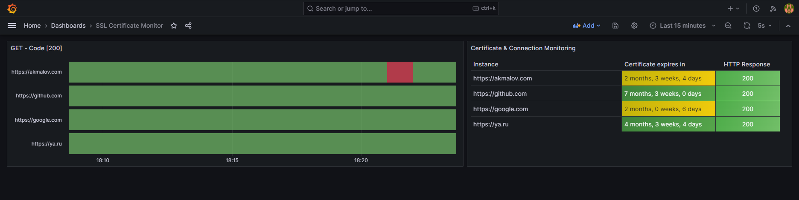
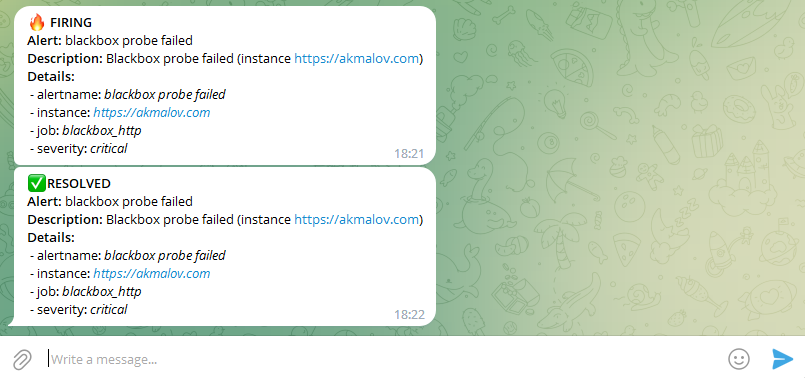

self-hosted сервер мониторинга доступности хостов, времени действия SSL сертификатов с оповещениями в telegram


[](/blog/monitoring-web-hosts)


<!--truncate-->
## Uptime-kuma

Если вам нужен самый простой и удобный инструмент мониторинга хостов, который можно поднять у себя на сервере проще воспользоваться сервисом `Uptime-Kuma`

[Uptime-Kuma](https://github.com/louislam/uptime-kuma)


Главные фишки:
* Мониторинг HTTP(s) / TCP / HTTP(s) Keyword / HTTP(s) Json Query / Ping / DNS 
* Лекго и просто развернуть в docker-compose
* Удобный и понятный графический интерфейс 
* Оповещения в Telegram, Discord, Slack, Email (SMTP) и т.д. 
* Информация о сертификате (SSL Certificate info)
* Поддержка Proxy и 2FA


При обнаружении проблем с доступностью, Uptime-Kuma быстро уведомляет пользователя различными способами, включая такие популярные платформы, как Telegram, Discord и Slack. 

Аналитические функции, такие как графики и статистика, предоставляют полезные данные для понимания причин проблем с доступностью, помогая пользователям своевременно реагировать и улучшать свои сервисы. 

В целом, Uptime-Kuma - это незаменимый инструмент для тех, кто хочет быть уверенным в непрерывной работе и доступности своих веб-сервисов.


## Сервер мониторинга

Если уже используется стэк для мониторинга Promeheus + Grafana можно воспользваться blackbox exporter и сделать удобный Dashboard для себя. Об этом сейчас и буду писать подробнее

**Простой пример мониторинга хостов и истечения срока действия SSL-сертификата**

[](./grafana-ssl-certificate-expires.png)


Используется следующие сервисы:
- Prometheus (сбор и база данных)
- Grafana (отображение данных)
- Blackbox (мониторинг http)
- Alertmanager (уведомления)

### Установка 

Сам проект на [Github monitoring hosts](https://github.com/akmalovaa/monitoring-hosts-cert/tree/main)


используется docker-compose 🐳

```bash
git clone https://github.com/akmalovaa/monitoring-hosts-cert.git
cd monitoring-hosts-cert
```

- Изменить конечные хосты `/prometheus/prometheus.yml`

- Настройка для отправки сообщений в телеграм `/alertmanager/config.yml`

- Добавить права на директорию для графаны:
``` bash
chmod -R 777 data/grafana/
```

Запустить сервисы
```bash
docker-compose up -d
```

Проверить сервисы
```bash
docker-compose ps
```

Telegram уведомления:


---

### Дополнительные материалы

* Grafana labs - [Dashboard](https://grafana.com/grafana/dashboards/13230-certificate-monitor/)

* Grafana blog - [Post SSL alerting](https://grafana.com/blog/2020/11/25/how-we-eliminated-service-outages-from-certificate-expired-by-setting-up-alerts-with-grafana-and-prometheus/)

* Github Prometheus, Grafana, blackbox, alertmanager + caddy - [docker-compose example](https://github.com/stefanprodan/dockprom/tree/master)
  
#### Настройки Alertmanager telegram

##### Bot token
Создайте бота и получите ключ API бота в канале [BotFather](https://t.me/BotFather)

##### Получить Chat ID telegram

Напишите пару тестовых сообщений созданному только что боту, затем выполните запрос

```bash
curl https://api.telegram.org/bot<TOKEN>/getUpdates | jq
```

#### docker-compose
``` 
version: "3.7"
services:
  prometheus:
    container_name: prometheus
    image: prom/prometheus:v2.46.0
    command:
      - '--config.file=/etc/prometheus/prometheus.yml'
      - '--storage.tsdb.path=/prometheus'
      - '--web.console.libraries=/etc/prometheus/console_libraries'
      - '--web.console.templates=/etc/prometheus/consoles'
      - '--storage.tsdb.retention.time=30d'
      - '--web.enable-lifecycle'
    user: root
    ports:
    - 9090:9090
    volumes:
    - ./prometheus:/etc/prometheus/
    - ./data/prometheus:/prometheus/
    restart: unless-stopped
    environment:
     - TZ="Asia/Yekaterinburg"

  blackbox:
    container_name: blackbox
    image: prom/blackbox-exporter:v0.24.0
    command:
      - '--config.file=/config/blackbox.yml'
    ports:
      - 9115:9115
    restart: unless-stopped
    volumes:
      - ./blackbox:/config
  
  alertmanager:
    container_name: alertmanager
    image: prom/alertmanager:v0.25.0
    command:
      - '--config.file=/etc/alertmanager/config.yml'
      - '--storage.path=/alertmanager'
    ports:
      - 9093:9093
    volumes:
      - ./alertmanager:/etc/alertmanager/
    restart: unless-stopped

  grafana:
    container_name: grafana
    image: grafana/grafana:10.0.3-ubuntu
    depends_on:
      - prometheus
    ports:
      - 3000:3000
    volumes:
      - ./data/grafana:/var/lib/grafana
      - ./grafana/dashboards:/etc/grafana/provisioning/dashboards
      - ./grafana/datasources:/etc/grafana/provisioning/datasources
    restart: unless-stopped
    environment:
      - GF_SECURITY_ADMIN_USER=${ADMIN_USER:-admin}
      - GF_SECURITY_ADMIN_PASSWORD=${ADMIN_PASSWORD:-admin}
      - GF_USERS_ALLOW_SIGN_UP=false
      - TZ="Asia/Yekaterinburg"
```

