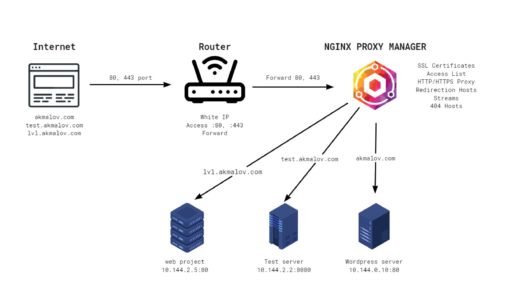
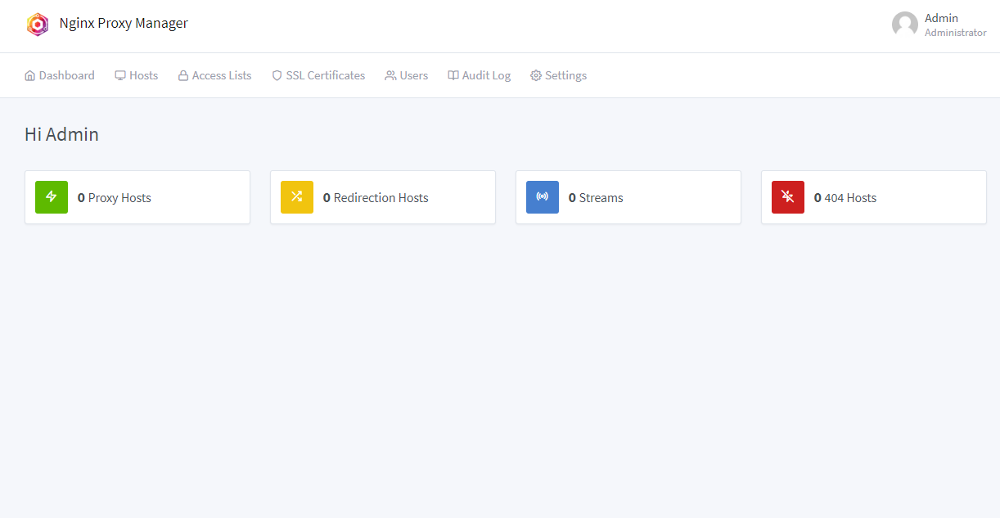
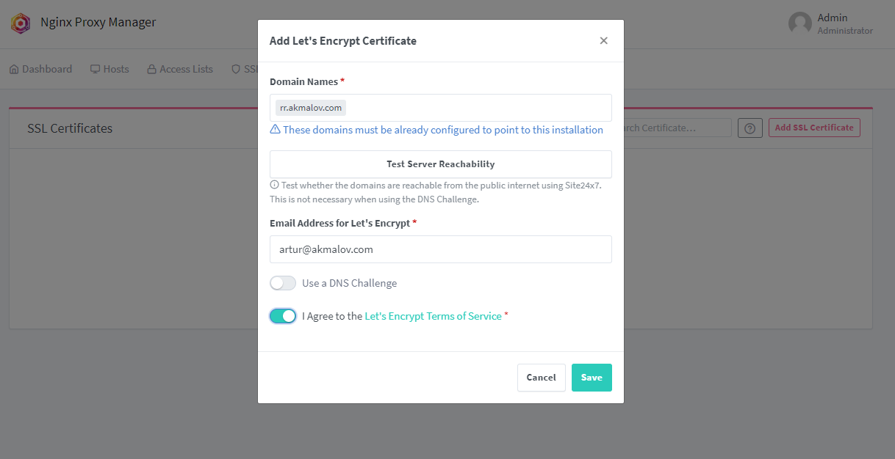
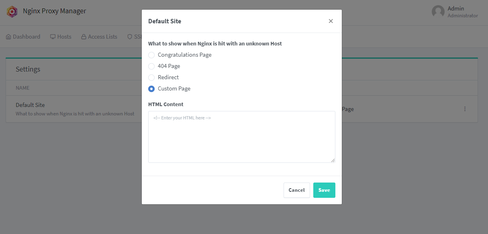

NGINX Proxy Manager - сервис (WEB GUI) для управления конфигурацией NGINX. Идет как готовый docker контейнер, в проекте реализовано максимально простое и удобное управление основными базовыми функциями NGINX.

[](/blog/nginx-proxy-manager)

<!--truncate-->
## NGINX Proxy Manager

Open Source проект ссылки на [Github](https://github.com/NginxProxyManager/nginx-proxy-manager) и [Офф сайт](https://nginxproxymanager.com/)

Возможности:
- Простой и удобный web интерфейс
- Легкая настройка проксирования без редактирования nginx config файла
- Управление пользователями, разрешения и журнал аудита
- Возможность установить свои или сгенерировать SSL сертификаты
- Контроль доступа, средства авторизации, разрешенные и запрещенные адрес листы.

Основное назначение это проксирование по URL домена.

Например имеются 3 домена:
- akmalov.com
- test.akmalov.com
- lvl.akmalov.com

Все домены обращаются по одному внешнему IP на маршрутизатор
Маршрутизатор перенаправляет все соединения которые идут на 80 или 443 порт на NGINX Proxy Manager
NGINX в зависимости от домена перенаправляет на необходимый сервер, VM, Container в локальной сети. Подставляет сертификат, управляет разрешениями.




### Установка NGINX Proxy Manager
#### 1. Подготовка среды

Буду устанавливать на LXC Proxmox

- OS: Ubuntu 22.02
- CPU: 2
- RAM: 1 Gb
- Disk: 10 Gb
  
Обновление пакетов и установка docker

```
apt update && apt upgrade -y
apt install -y docker.io docker-compose
```

#### 2. Настройка docker-compose.yaml

```YAML
version: "3"
services:
  nginx-proxy-manager:
    image: 'jc21/nginx-proxy-manager:latest'
    restart: unless-stopped
    ports:
      - '80:80' # HTTP port
      - '443:443' # HTTPS port
      - '81:81' # Admin web port
    volumes:
      - ./data:/data
      - ./letsencrypt:/etc/letsencrypt
```

По умолчанию создается файловая база данных SQLite - `data/database.sqlite`
Есть так же решения c использованием отдельной базы данных MySQL на офф.сайте. 
В моем случаи SQLite хватает с огромным запасом

Запуск контейнера
```
docker-compose up -d
```
После запуска контейнера, можно подключиться к панели администратора

`http://YOUR-IP:81/`

Логин и пароль по умолчанию
```
Email: admin@example.com
Password: changeme
```

При первом запуске предложит настроить админскую учетную запись и изменить пароль

### Настройка NGINX Proxy Manager
Так выглядит изначально GUI главного экрана (Все по нулям т.к. ничего не добавляли еще)



SSL сертификаты есть возможность сгенерировать с помощью Let'Encrypt в одно нажатие или добавить свои сертификаты



### Настройка Host Proxy NGINX
Все также интуитивно понтяно, прописываю домен, порт, если нужно подставляю  сертификат SSL для HTTPS


Для работы доменов из локальной сети необходимо в DNS домены которые добавлены в Proxy Host направлять на адрес NGINX Proxy Manager

В общем и целом этого хватает для решения задач которые описал выше. Хоть и конфиг был бы не такой сложной, но с помощью этого сервиса можно это сделать в несколько кликов.

## Дополнительные функции

Распишу еще кое какие полезные фичи, которые использую у себя

### Dashboard для nginx proxy manager

Проект отнсительно свежий и активно разрабаывается, выглядит интересно

[Ссылка на Git автора](https://github.com/xavier-hernandez/goaccess-for-nginxproxymanager)


Красивый графический вывод информации на основе логов, позволяет посмотреть статистику, оценить нагрузку. Написано на Go работает быстро, даже с большим объемом данных, не потребляет много ресурсов.

В docker-compose необходимо указать путь к логам от nginx proxy manager


### Страница 404 для nginx proxy manager

Nginx позволяет вместо ошибки 404 сделать redirect на любой другой хост или даже указать свой HTML код



Воспользуюсь Redirect и сделаю красивую страницу для 404

[Ссылка на Docker Hub проекта](https://hub.docker.com/r/kale5/rickroll)


Теперь вместо страницы ошибок он будет перенаправлять на этот URL, с качественным видео

### Итоговый docker-compose

В итоге конечный docker-compose у меня выглядит так:
```YAML
version: "3"
services:
  nginx-proxy-manager:
    image: 'jc21/nginx-proxy-manager:latest'
    restart: unless-stopped
    ports:
      - '80:80' # HTTP Port
      - '443:443' # HTTPS Port
      - '81:81' # Admin Web Port
    volumes:
      - ./data:/data
      - ./letsencrypt:/etc/letsencrypt

  npm-monitoring:
    image: xavierh/goaccess-for-nginxproxymanager:latest
    restart: always
    environment:
        - TZ=Asia/Yekaterinburg
        - SKIP_ARCHIVED_LOGS=True #optional
        - EXCLUDE_IPS=127.0.0.1 #optional
        - LOG_TYPE=NPM
    ports:
        - '82:7880'
    volumes:
        - ./data/logs:/opt/log
  
  error-page-404:
    image: 'kale5/rickroll:latest'
    restart: unless-stopped
    ports:
      - '83:80'
```

## Итоги
Мне очень нравится этот сервис позволяет быстро легко поднять и настроить NGINX,  каких-то проблем с ним не было, сам продлевает сертификаты, одним словом настроил и забыл и иногда только заходил и через web добавлял новые хосты в 2-3 клика.

Так же есть аналог - Traefik, на данный момент активно его изучаю, но там нет удобного интерфейса и вся настройка через конфиги, т.к. больше погружаюсь в автоматизацию и много сервисов которые надо динамически настраивать, больше упор именно на traefik идет.
