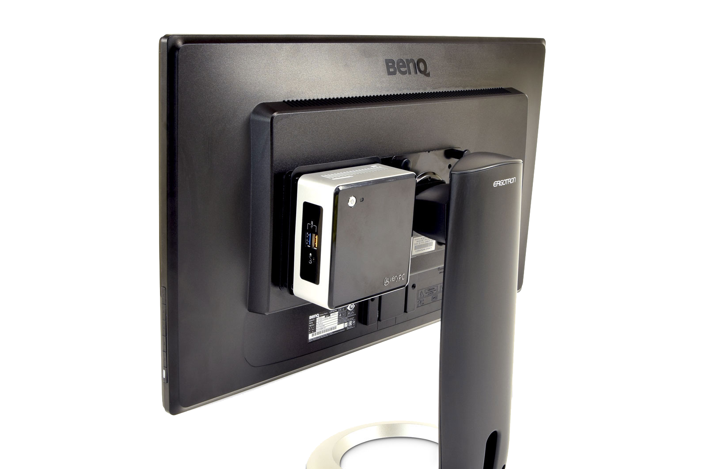
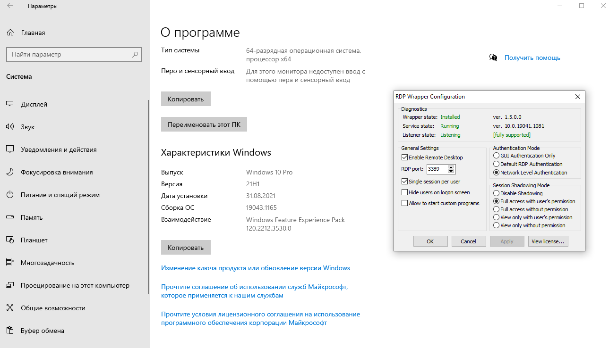
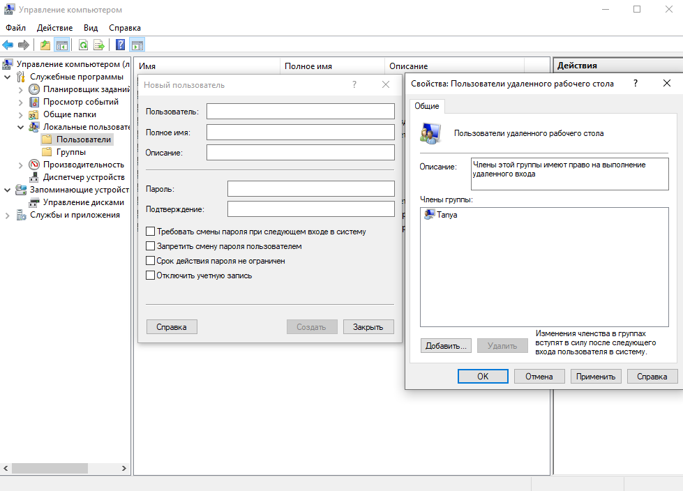

Для чего нужен RDP wrapper для дома, как его устанавливать, краткая инструкция как создать пользователя для удаленного рабочего стола

<!--truncate-->

## Для чего нужен RDP wrapper?
### Про стандартный RDP

RDP (Remote Desktop Protocol) — дословно протокол Удаленного Рабочего Стола. Позволяет подключится к компьютеру по IP адресу с любого другого компьютера.  

Подключение по протоколу RDP осуществляется между компьютерами, находящимися в одной локальной сети, или по интернету, но для этого потребуются дополнительные действия – проброс порта 3389 на роутере, либо соединение с удаленным компьютером по VPN.

Для подключения к удаленному рабочему столу , необходимо разрешить удаленное подключение — Свойства компьютера — дополнительные параметры системы —  удаленный доступ

- **Windows 10 Home** — данная функция отключена
- **Windows 10 Pro** — позволяет одновременно использовать только одно подключение под выбранным пользователем
- **Windows Server** — позволяет подключаться сразу с нескольких устройств, под разными пользователями и работать одновременно.

При подключении используются все ресурсы удаленного компьютера, позволяет передавать принтеры, буфер обмена, диски, порты, устройства захвата. Благодаря этому часто в организациях ставят мощный сервер, а пользователям дают монитор с мышкой, клавиатурой и слабенький ПК в качестве тонкого клиента, который служит только для подключения к серверу. При этом все пользователи будут полноценно работать на производительном сервере.

Так же RDP часто используется в 1С для работы с файловой базой данных

### О RDPwrapper

Была такая репа на Github <https://github.com/stascorp/rdpwrap>.
Цель этого проекта - включить поддержку хоста удаленного рабочего стола и одновременные сеансы RDP в системах с ограниченной функциональностью для домашнего использования.

т.е. позволяет на любой системе использовать все преимущества RDP как в Windows Server, что является нарушением лицензии и делать такое нельзя. Далее в ознакомительных целях

## Установка

1. Отключить антивирус, создать папку C:\Program Files\RDP Wrapper и добавить его в ислючение

2. Скачать RDP Wrapper <https://github.com/stascorp/rdpwrap/releases/download/v1.6.2/RDPWrap-v1.6.2.zip> и распаковать в ранее созданную папку
3. Скачать файл [autoupdate.bat](https://t.me/rdpwrap/31497) и распоквать в ту же папку с RDP Wrapper
4. Запустить run autoupdate.bat от имени администратора
5. Перезагрузить
6. Проверяем

## Добавление нового пользователя
Создать нового пользователя (учетную запись Windows)

Добавить новому пользователю членство в группе «Пользователи удаленного рабочего стола»

Таким образом можно спокйно использовать домашний ПК и его производительность делить на несколько пользователей

При обновлении Windows возможно будет необходимо запустить файл autoupdate.bat

Самое большое количество вопросов, обсуждений и помощи по данной теме происходит в телеграмм группе <https://t.me/rdpwrap>
