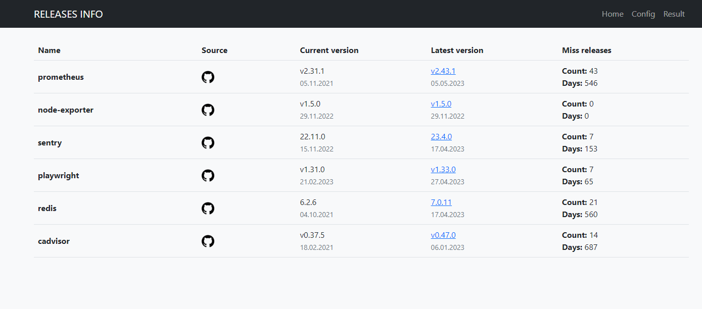

Решение для проверки последних релизных версий. Готовый docker файл, написан с использованием Python, Flask

[](/blog/releases-info)


<!--truncate-->
## Releases info

Страница на [Github](https://github.com/akmalovaa/releases-info)

Сервис проверяет новые версии ваших проектов и показывает, отставание от последних релизов


На данный момент проверка только с github проектов, где есть релизный список, планируется добавить проверку версий образов с [Docker hub](https://hub.docker.com/)

## Запуск

Скопировать .env.example в .env файл и вставить свой github token (нужен для обращения к github API)
```
cp .env.example .env
```

Запустить docker-compose

```
docker-compose up -d
```

## Настройка

Необходимо изменить файл config.yml:

```yaml
services:
  sentry:
    github:
      owner: getsentry
      repo: sentry
    version: 22.11.0
```

Например ссылка <https://github.com/getsentry/sentry>

- owner (владелец) - getsentry
- repo (репозиторий) - sentry

## Планы

- Добавить проверку обновлений Docker HUB
- Уведомления в Telegram о новых релизах
- Автоматический парсинг версии с iac
- Улучшить интерфейс, попробовать React
- Подумать насчет базы данных
