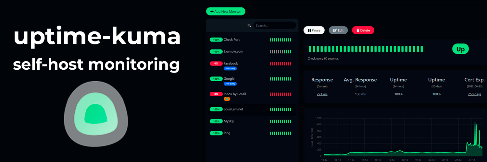
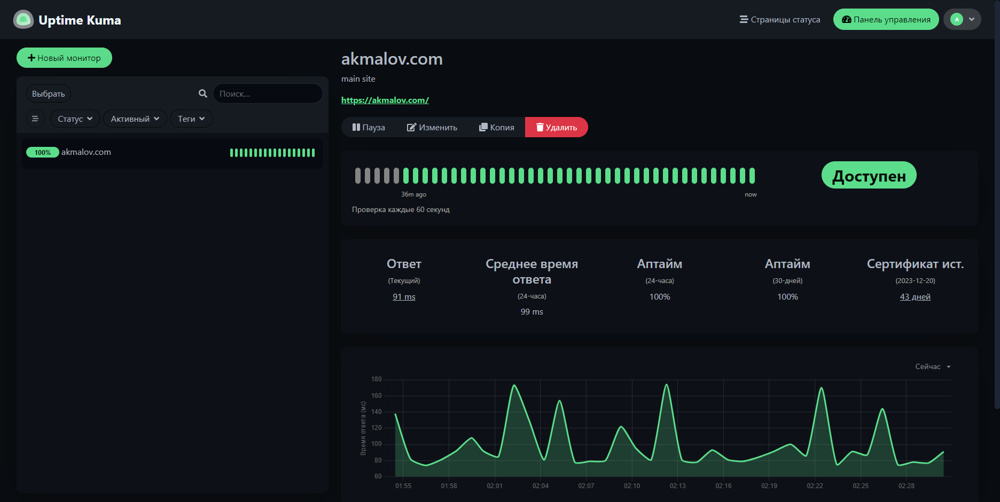
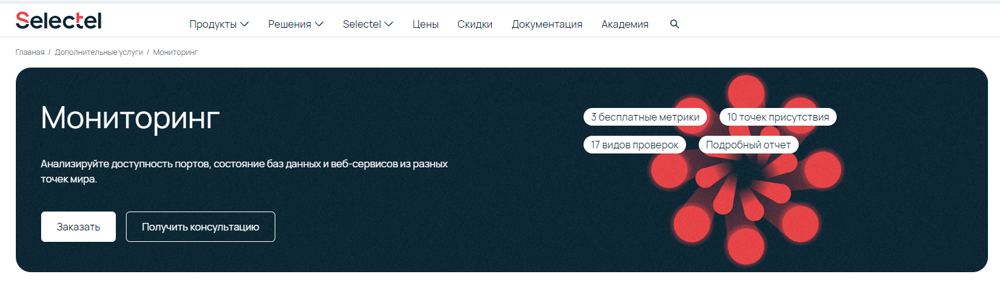
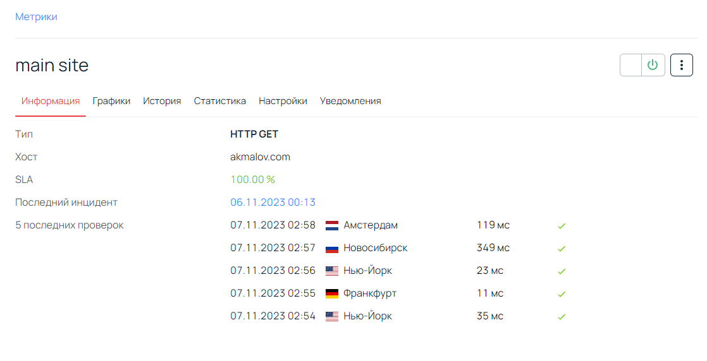

Внешний сервис для мониторинга доступности хостов


[](/blog/uptime-kuma)


<!--truncate-->
## Внешний мониторинг хостов

Для того чтобы проверять доступность своих сервисов снаружи (с интернета), необходим внешний инструмент мониторинга.
Это один из сервисов, которые приходится поднимать снаружи, не на своей инфраструктуре, т.к. внутренний мониторинг в этом деле не особо подходит, даже когда внутри все сервисы выглядят живыми, снаружи может не быть доступа по разным причинам.

Пробовал использовать разные варианты но самым простым оказался **uptime-kuma** сервис, который предоставляет простой и удобный способ мониторинга хостов.


## О проекте uptime-kuma 

Ссылка на [Github](https://github.com/louislam/uptime-kuma)

Основные плюсы:
- Большой выбор инструментов (способов) мониторинга HTTP, TCP, json, ping, DNS, Push, Steam сервисы, Docker контейнеры
- Простой интуитивно понятный web интерфейс
- Уведомления через Telegram, Discord, Gotify, Slack, Pushover, электронную почту (SMTP) и т.д.
- Мультиязычный
- Возможность создания отдельных страниц для предоставления общего доступа к статусам
- Вывод результатов в графике
- Информация о сертификатах SSL и сроках действия
- Поддержка прокси-сервера
- Поддержка 2FA (двухфакторной аутентификации)
- Open-source


[](./orig.png)


## Установка

Планирую использовать облачный север от timeweb, можно взять сервер в РФ или заграницей

[](./timweb-server.png)

Подойдут минимальные характеристики, для удобства планирую использовать еще и доменное имя - `monitoring.example.com`

- **OS**: Ubuntu 22.02
- **CPU**: 1 x 2.8 ГГц
- **RAM**: 1 Gb
- **SSD**: 15 Gb

### 1. Подготовка

Обновление пакетов и установка docker

```
apt update && apt upgrade -y
apt install -y docker.io docker-compose
```

Конфигурация DNS перенаправление `monitoring.example.com` - на полученный белый IP от timeweb

### 2. Настройка docker-compose.yaml

```YAML
version: '3.8'
services:
  caddy:
    image: caddy:2.7.5
    ports:
      - 80:80
      - 443:443
    volumes:
      - ./Caddyfile:/etc/caddy/Caddyfile
    restart: always
  
  uptime-kuma:
    image: louislam/uptime-kuma:1.23.3-debian
    volumes:
      - ./uptime-kuma:/app/data
    restart: always
```

Для автоматического получения SSL сертификата использую Caddy и создаю файл конфигурации **Caddyfile**

```bash
touch Caddyfile
```

Содержимое **Caddyfile**:
```JSON
monitoring.example.com {
    reverse_proxy uptime-kuma:3001
}
```

Запуск контейнера
```
docker-compose up -d
```


## Запуск и настройка

После запуска контейнера, можно подключиться к веб панели по домену **monitoring.example.com**. 

Proxy сервис Caddy сам сходит получит сертификат и будет перенаправлять на HTTPS

При первом подключении, нужно создать пользователя и придумать пароль

В настройках:
- Проверить временную зону
- Переключить на темную тему
- Сменить язык на удобный
- Добавить настройки для Telegram уведомлений

Далее можно уже добавить первый монитор

[](./main-site.png)

По всем настройкам интерфейса, делать скрины и подробно расписывать не вижу смысла, все и так интуитивно понятно, а если вдруг хочется посмотреть и потыкаться, то на офф странице есть [демо](https://uptime.kuma.pet/)

## Итоги

Мне очень понравился этот сервис, из того, что точно буду использовать:
- GET запрос для проверки сайта
- ping серверов
- проверка ответов API сервисов
- оповещения в telegram
- мониторинг срока действия ssl сертификатов

Использование ресурсов (поднятый docker + 10 точек мониторинга занимают 140Mb RAM и минимальное CPU)

Из необычного, что впечатлило:
- Есть реверс проверка статуса (когда наоборот, если монитор стал доступен, то как ошибку воспринимать)
- Push мониторинг - когда конечный сервис например за Proxy, NAT и нет к нему прямого доступа, можно с этого сервера Push отправлять на север uptime-kuma, которые он будет получать и мониторить
- Специфичные средства мониторинга (Steam игровой сервер, PostgreSQL, Redis, Kafka, MongoDB и т.д.)
- Можно создать дополнительную страницу, где вывести необходимые мониторы и поделиться ссылкой для просмотра (без аутентификации)

Из минусов это единственная точка(узел) мониторинга и если будут проблемы на стороне облачного провайдера, то внешний мониторинг встанет, так же мониторинг с единственного узла не всегда показывает полную картину (например с других стран могут быть проблемы, о которых не получится оперативно узнать)

### Бонус

Для минуса который описал выше, есть небольшое бесплатное решение, это мониторинг Selectel

[](./selectel.png)

Если войти с панель управления под своим аккаунтом, можно бесплатно поставить в мониторинг до 3 метрик
    
Здесь так же имеются различные типы метрик, гибкие настройки, но самое главное 8 раличных точек мониторинга
[](./selectel_get.png)

- Франкфурт
- Лондон
- Амстердам
- Москва
- Новосибирск
- Санкт-Петербург
- Нью-Йорк
- Сан-Франциско

Возможно, кому хватит такого количества метрик и нет желания поднимать и настраивать облачный сервер, данный вариант покажется даже удобнее.