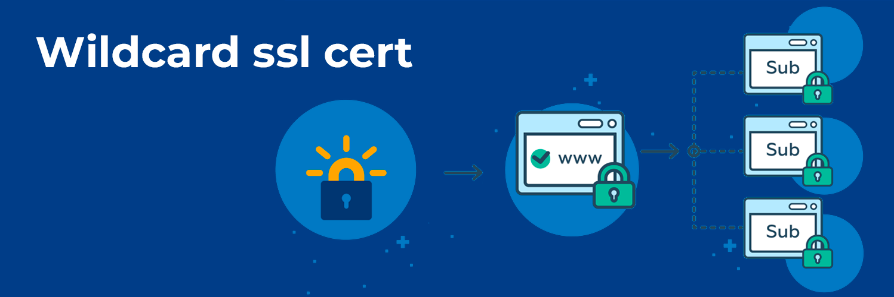

Простой способ получить wildcard SSL сертификат для своего домена с использованием Cloudflare и acme.sh


[](/blog/wildcard-ssl-cert)


<!--truncate-->
## Wildcard сертификат

Нравится изучать различные OpenSource проекты, и сейчас для многих сервисов которые запускаю у себя на серверах требуются доверенные сертификаты SSL

Имеется свой собственный домен `akmalov.com` и поддмены следующего уровня `*.akmalov.com` создавать в любом количестве и не проблема

Раньше пробовал использовать свой центр сертификации, прописывал в доверенных, создавал сампоподисанные сертификаты (очень неудобно, слишком много ресурсов для песочницы). 
Далее решил перейти на скрипты и для отдельных поддоменов заказывал сертификаты с помощью **Let's Encrypt** и когда поддоменов набралось больше десятка решил попробовать **wildcard** сертификат, который может быть применен для всех поддоменов.

> Один сертификат для всех поддоменов

[](./wildcard.jpg)


## ACME Shell script

После того как перепробовал различные варианты получения сертификатов, для меня самым удобным показался **acme.sh**

Ссылка на офф [Github](https://github.com/acmesh-official/acme.sh)

- Unix shell скрипт без лишних зависимостей
- Не нужны root права
- Есть docker образ
- Поддерживает IPv6
- Можно использовать в cron-job для автоматического обновления сертификатов
- Простые команды для управления
- Умеет по API обращаться к Cloudflare


## Cloudflare

Для управлениями DNS записями домена использую Cloudflare, из за его популярности и возможности управления по API, для многих сервисов есть очень удобные интеграции. Одна из причин выбора acme.sh это как раз, то что он дружит Cloudflare.

:::note
Если используется другой DNS провайдер, можно использовать ручной способ указанный в документации, где придется вручную создавать `TXT` записи в админке домена
:::

Пошагово получение API токена в Cloudflare:
- Войти в свой аккаунт [Cloudflare](https://dash.cloudflare.com)
- Нажать на иконку профиля в верхней части экрана и выбрать **My Profile** в выпадающем меню.
- Далее выберите **API Tokens** на левой панели меню.
- Нажать на кнопку **Create Token** в верхней части страницы.
- Выбрать тип токена, который нужен, задать параметры и уровень доступа для токена. 
- На странице созданного токена нужно скопировать  **API Token** и сохранить его (отображается только при создании больше его увидеть не получится, только пересоздать)

:::danger Осторожно
Токен нельзя светить где попало
:::

[](./cloudflare-api.png)

## Docker acme.sh

Как один из больших поклонников контейнеров, не фанат устанавливать что-либо на хост систему, даже если это просто копирование скриптов. 
Разработчики данного сервиса такого же мнения 💕

Страница на Github - [**Run acme.sh in docker**](https://github.com/acmesh-official/acme.sh/wiki/Run-acme.sh-in-docker)

Официальный образ [**Dockerhub**](https://hub.docker.com/r/neilpang/acme.sh)

Загрузить последнюю версию или tag `latest`, привык использовать конкретную версию:
```bash
docker pull neilpang/acme.sh:3.0.6 
```

Для удобства с переменными буду использовать `.env` файл, следующего содержания:
```
EMAIL=artur@example.com
URL=example.com
WILDCARD_URL=*.example.com

CF_Token=Your cloudflare API TOKEN
```

В начале необходимо выполнить команду регистрации ACME по **email**, которая будет использоваться для создания ключа.

Полученный в результате файл, нужен будет для запуска следующей команды и поэтому его необходимо сохранить вне контейнера.

Команда `-v "./acme_data":/acme.sh` позволит создать локально на хосте директорию в которую будут сохраняться полученные файлы и останутся даже когда контейнер отработает и закроется.
```bash
docker run --rm --env-file .env -v "./acme_data":/acme.sh neilpang/acme.sh:3.0.6 --register-account -m $EMAIL
```
В логах должно быть сообщение об успешной регистрации аккаунта

``` 
> Create account key ok.
> Registered
> ACCOUNT_THUMBPRINT='ACCOUNT KEY'
```

Запрос **wildcard** сертификата
```bash
docker run --rm --env-file .env -v "./acme_data":/acme.sh neilpang/acme.sh:3.0.6 --issue -d $URL -d $WILDCARD_URL  --dns dns_cf
```

Процесс занимает примерно 3-7 минут

В логах по результатам запроса:
``` 
> Multi domain='DNS:example.com,DNS:*.example.com'
> Getting domain auth token for each domain
> Getting webroot for domain='example.com'
> Getting webroot for domain='*.example.com'
> Adding record
> Added, OK
> The txt record is added: Success.
> Let's check each DNS record now. Sleep 20 seconds first.
> Checking example.com for _acme-challenge.example.com
> Domain example.com '_acme-challenge.example.com' success.
> All success, let's return
> Verifying: example.com
> Processing, The CA is processing your order, please just wait. (1/30)
> Success
> Removing DNS records.
> Removed: Success
> Downloading cert.
> Cert success.
```

Сертификат получен и готов для использования (срок 3 месяца), все файлы сохранены локально в директории `./acme_data`
```bash
ls -la acme_data/example.com_ecc
```

```output
-rw-r--r-- 1456 Sep 24 18:33 example.com.cer
-rw-r--r--  566 Sep 24 18:33 example.com.conf
-rw-r--r--  477 Sep 24 18:29 example.com.csr
-rw-r--r--  202 Sep 24 18:29 example.com.csr.conf
-rw-------  227 Sep 24 18:28 example.com.key
-rw-r--r-- 2668 Sep 24 18:33 ca.cer
-rw-r--r-- 4124 Sep 24 18:33 fullchain.cer
```

Можно проверить полученный сертификат командой:
```bash
openssl x509 -in acme_data/example.com_ecc/example.com.cer -text -noout
```

или онлайн сервисом [Certificate Decoder](https://www.sslshopper.com/certificate-decoder.html)

Дальше тоже можно автоматизировать, создав расписание на выполнение и отправку результатов куда нужно.

