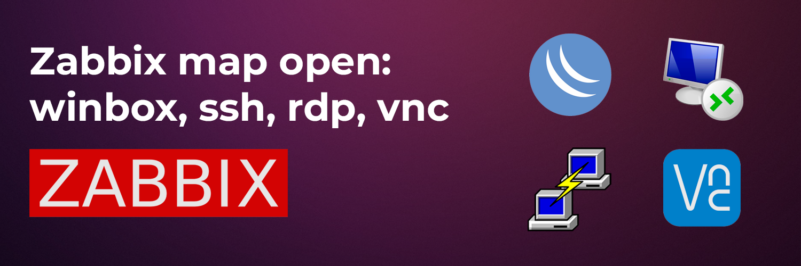

Zabbix maps быстрое подключение к хостам по winbox, ssh, rdp, vnc

[](/blog/zabbix-open-winbox)
<!--truncate-->

## Введение 

Странный скрипт, который использовал в 2016 году для быстрого подключения к серверам и сетевым устройствам. 
Раньше проект был на **github**, удалил из-за неактуальности и в течении года написало больше 10 человек в телеграм, хотя не одной звезды там не было.

Выкладываю код и инструкцию для анонимных любителей костылей.

Ссылка на проект [github zabbix-url](https://github.com/akmalovaa/zabbix-url)

**Возможность подключаться**:
- Winbox
- Putty
- VNC
- RDP
- WinMTR

:::warning Особенность
Работает только Windows
:::

:::tip Совет
Давно не пользовался zabbix, возможно уже есть способы сделать это удобнее
:::


## Цель

Одним нажатием подключаться прямо с карты к выбранному хосту для диагностики


## Принцип работы

Регистрируем в реестре windows (windows registry) URL протокол
```
URL Protocol"="zurl"
```

И сообщанием что такие URL нужно будет открывать через программу `C:/zurl/zurl.exe`

Например, при открытии `zurl://winbox/ip=10.0.0.1/user=admin` браузер запустит приложение `zurl.exe` и передаст ему всю строку, 
где можно распарсить и открыть нужное приложение для подключения

[](https://github.com/akmalovaa/zabbix-url/blob/main/images/config_uri.png)

## Инструкция

### 1. Скопировать проект

Нужен путь `C:\zurl`

```shell
git clone https://github.com/akmalovaa/zabbix-url.git C:\zurl
```

Если вам нужно использовать другую директорию, отредактируйте код и пересоберите проект `.exe`


### 2. Добавить zurl protocol в реестр windows

Запустить файл `zurl_registry.reg`

### 3. Изменить конфигурацию Zabbix

`Administration -> General -> Other`

Добавление схем проверки URI: `zurl`

[](https://github.com/akmalovaa/zabbix-url/blob/main/images/config_uri.png)


### 4. Добавить URL-адрес на карте

Измените настройки хоста на карте

**Формат URL:**
```
zurl://SERVICE_NAME/ip=IP_ADDRESS/user=USER/password=PASSWORD/port=PORT
```

#### Примеры:


**Winbox**
```
zurl://winbox/ip=10.0.0.1
zurl://winbox/ip=10.0.0.1/user=admin
zurl://winbox/ip=10.0.0.1/user=admin/password=12345
```

**Putty**
```
zurl://putty/ip=10.0.0.1
zurl://putty/ip=10.0.0.1/user=root
zurl://putty/ip=10.0.0.1/user=root/port=22
```

**VNC**
```
zurl://vnc/ip=10.0.0.1/port=5900
```

**WinMTR**
```
zurl://mtr/ip=10.0.0.1
```

**RDP**
```
zurl://rdp/ip=10.0.0.1
```

вы можете использовать переменные zabbix, например `{HOST.IP}`

[](https://github.com/akmalovaa/zabbix-url/blob/main/images/zurl_host_ip.png)

[](https://github.com/akmalovaa/zabbix-url/blob/main/images/urls_rdp.png)

[](https://github.com/akmalovaa/zabbix-url/blob/main/images/urls_winbox.png)


## Разработка

Для конвертирования `.py` в `.exe` можно использовать PyInstaller в Python.

Еще есть удобная штука с графическим интерфейсом `auto-py-to-exe`

Установка:
```shell
pip install auto-py-to-exe
```

Запуск:
```shell
auto-py-to-exe
```

