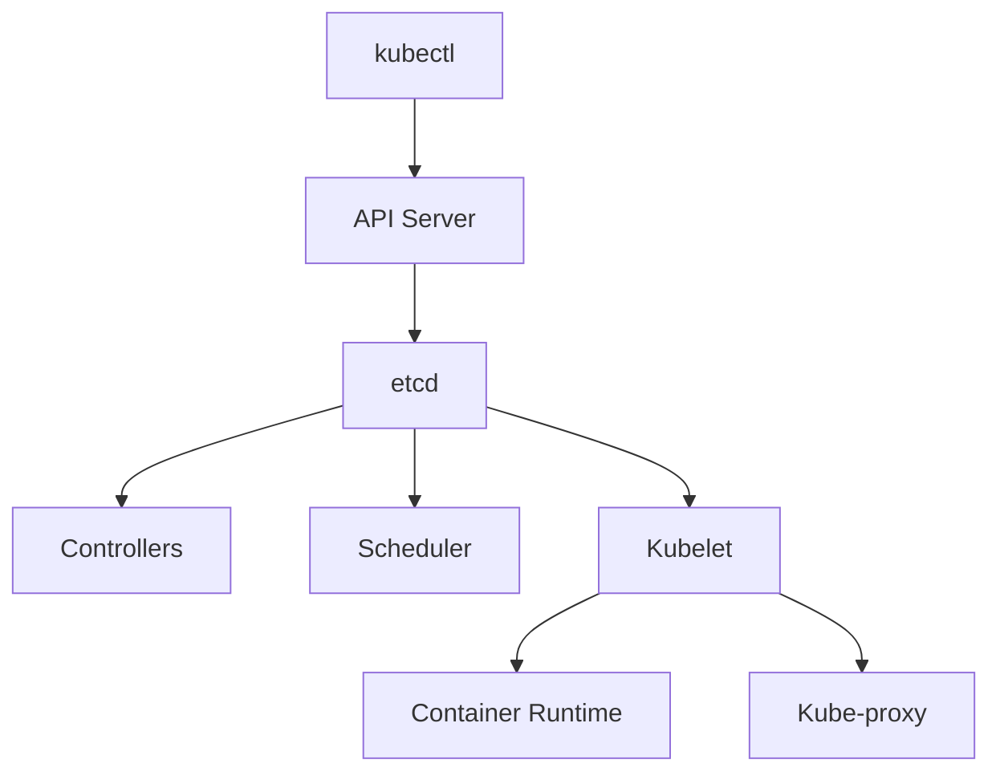

# Заметки k8s

Конспекты по Kubernetes с объяснениями основных концепций и компонентов.

:::tip Официальная документация
Всегда актуальная информация доступна в [официальной документации Kubernetes](https://kubernetes.io/docs/home/)
:::

## Архитектура Kubernetes

Ниже собрал диаграммы(схемы) компонентов Kubernetes из различных источников:
[](./components-of-kubernetes.png)
[](./k8s-arch2.png)
[](./k8s-arch3.png)
[](./Kubernetes-components.png)
[](./maxresdefault.jpg)

## Компоненты Control Plane (Master Node)

Control Plane управляет состоянием кластера и принимает глобальные решения о планировании подов.

### API Server (kube-apiserver)

**Центральный компонент кластера** - основная точка входа для всех REST-запросов.

**Функции:**

- Аутентификация и авторизация пользователей
- Валидация и мутация запросов
- Сериализация объектов в etcd
- Обслуживание REST API для всех операций кластера

### Scheduler (kube-scheduler)

**Планировщик подов** - определяет оптимальную ноду для размещения нового пода.

**Алгоритм работы:**

1. Фильтрация доступных нод по требованиям пода
2. Ранжирование подходящих нод по различным критериям
3. Назначение пода на ноду с наивысшим рейтингом

**Факторы планирования:**

- Доступные ресурсы (CPU, память)
- Политики размещения и anti-affinity
- Taints и tolerations
- Node selectors

### Controller Manager (kube-controller-manager)

**Управляющий демон** - запускает контроллеры, которые регулируют состояние кластера.

**Основные контроллеры:**

- **Node Controller** - отслеживает состояние нод
- **Replication Controller** - поддерживает нужное количество реплик
- **Endpoints Controller** - связывает Services и Pods
- **Deployment Controller** - управляет развертываниями

### etcd

**Распределенное хранилище ключ-значение** - база данных кластера.

**Особенности:**

- Хранит все манифесты и состояние кластера
- Требует кворум для работы (нечетное количество экземпляров)
- Обеспечивает консистентность данных
- Поддерживает снэпшоты для восстановления

## Компоненты Worker Node

Worker Node выполняют фактическую работу по запуску приложений.

### Pod

**Базовая единица развертывания** в Kubernetes - группа из одного или нескольких контейнеров.

**Особенности:**

- Контейнеры в поде разделяют сетевое пространство и хранилище
- Имеют общий IP-адрес и могут общаться через localhost
- Всегда планируются и выполняются на одной ноде
- Эфемерны - могут быть созданы, уничтожены и пересозданы

### Kubelet

**Агент узла** - основной компонент на каждой worker ноде.

**Функции:**

- Получает спецификации подов от API сервера
- Управляет жизненным циклом подов на ноде
- Отправляет отчеты о состоянии нод и подов в API сервер
- Выполняет проверки работоспособности (health checks)
- Управляет томами (volumes)

### Kube-proxy

**Сетевой прокси** - обеспечивает сетевую связность для сервисов.

**Функции:**

- Управляет правилами сетевой маршрутизации на узле
- Реализует балансировку нагрузки для сервисов
- Поддерживает различные режимы: iptables, IPVS, userspace
- Обеспечивает доступность сервисов через ClusterIP, NodePort, LoadBalancer

### Container Runtime

**Среда выполнения контейнеров** - программное обеспечение для запуска контейнеров.

**Поддерживаемые среды:**

- **containerd** - легковесная, высокопроизводительная
- **Docker Engine** - популярная, но более тяжеловесная
- **CRI-O** - оптимизированная для Kubernetes

### Дополнительные компоненты (Add-ons)

**Необязательные компоненты** для расширения функциональности кластера:

- **CNI плагины** (Calico, Flannel, Weave) - сетевое взаимодействие
- **RBAC** - контроль доступа на основе ролей
- **DNS** (CoreDNS) - разрешение имен внутри кластера
- **Dashboard** - веб-интерфейс управления
- **Ingress Controllers** - управление внешним трафиком  

## Основные объекты Kubernetes

### Иерархия: Deployment → ReplicaSet → Pod

**Декларативный подход** - описываем желаемое состояние, а не последовательность действий.

**Deployment** - высокоуровневый объект для управления приложениями:

- Создает и управляет ReplicaSet
- Обеспечивает декларативные обновления
- Поддерживает стратегии развертывания (Rolling Update, Recreate)
- Позволяет откатываться к предыдущим версиям

**ReplicaSet** - обеспечивает заданное количество реплик подов:

- Создается автоматически Deployment
- Контролирует количество запущенных подов
- Заменяет неисправные поды

**Pod** - минимальная единица развертывания:

- Содержит один или несколько контейнеров
- Имеет уникальный IP-адрес в кластере
- Разделяет хранилище между контейнерами

#### Пример Deployment

```yaml
apiVersion: apps/v1
kind: Deployment
metadata:
  name: nginx-deployment
  namespace: default
  labels:
    app: nginx
spec:
  replicas: 3
  strategy:
    type: RollingUpdate
    rollingUpdate:
      maxUnavailable: 1
      maxSurge: 1
  selector:
    matchLabels:
      app: nginx
  template:
    metadata:
      labels:
        app: nginx
    spec:
      containers:
      - name: nginx
        image: nginxdemos/hello:0.2
        ports:
        - containerPort: 80
          name: http
        livenessProbe:
          httpGet:
            path: /
            port: 80
          initialDelaySeconds: 30
          periodSeconds: 10
        readinessProbe:
          httpGet:
            path: /
            port: 80
          initialDelaySeconds: 5
          periodSeconds: 5
        resources:
          limits:
            cpu: "500m"
            memory: "128Mi"
          requests:
            cpu: "250m"
            memory: "64Mi"
```

### Service

**Абстракция для доступа к подам** - обеспечивает стабильную точку входа к набору подов.

**Проблемы, которые решает Service:**

- Поды имеют эфемерные IP-адреса
- Поды могут быть пересозданы в любой момент
- Необходимость балансировки нагрузки между репликами

**Типы Service:**

#### ClusterIP (по умолчанию)

- Внутренний IP кластера
- Доступен только внутри кластера
- Используется для межсервисного взаимодействия

#### NodePort

- Открывает порт на всех нодах кластера
- Диапазон портов: 30000-32767
- Доступен извне кластера

#### LoadBalancer

- Создает внешний балансировщик нагрузки (в облаке)
- Автоматически создает ClusterIP и NodePort
- Получает внешний IP от провайдера

#### ExternalName

- Создает CNAME запись для внешнего сервиса
- Не создает прокси или балансировщик

#### Примеры Service

**ClusterIP Service:**

```yaml
apiVersion: v1
kind: Service
metadata:
  name: nginx-service-clusterip
  namespace: default
spec:
  type: ClusterIP
  selector:
    app: nginx
  ports:
  - name: http
    port: 80
    targetPort: 80
    protocol: TCP
```

**NodePort Service:**

```yaml
apiVersion: v1
kind: Service
metadata:
  name: nginx-service-nodeport
  namespace: default
spec:
  type: NodePort
  selector:
    app: nginx
  ports:
  - name: http
    port: 80
    targetPort: 80
    nodePort: 30080
    protocol: TCP
```

**LoadBalancer Service:**

```yaml
apiVersion: v1
kind: Service
metadata:
  name: nginx-service-loadbalancer
  namespace: default
spec:
  type: LoadBalancer
  selector:
    app: nginx
  ports:
  - name: http
    port: 80
    targetPort: 80
    protocol: TCP
```

## Проверки работоспособности (Health Checks)

Kubernetes использует **пробы (probes)** для определения состояния контейнеров. Проверки выполняет kubelet.

### Типы проб

#### Startup Probe

**Проверка запуска** - определяет, когда контейнер готов к работе.

**Когда использовать:**

- Для приложений с долгим временем запуска
- Когда нужно отключить другие пробы до завершения инициализации

**Поведение:**

- Выполняется только при запуске контейнера
- Блокирует выполнение liveness и readiness проб
- При неудаче контейнер перезапускается

#### Liveness Probe

**Проверка жизнеспособности** - определяет, нужно ли перезапустить контейнер.

**Когда использовать:**

- Для обнаружения зависших приложений
- При необходимости перезапуска проблемных контейнеров

**Поведение:**

- Выполняется периодически во время работы контейнера
- При неудаче контейнер перезапускается
- Не влияет на готовность к обслуживанию трафика

#### Readiness Probe

**Проверка готовности** - определяет, готов ли контейнер принимать трафик.

**Когда использовать:**

- Для приложений, которым нужно время на прогрев
- При зависимости от внешних сервисов

**Поведение:**

- Выполняется периодически во время работы контейнера
- При неудаче под исключается из Service endpoints
- Контейнер не перезапускается

### Методы проверки

#### HTTP GET

```yaml
livenessProbe:
  httpGet:
    path: /health
    port: 8080
    httpHeaders:
    - name: Custom-Header
      value: health-check
  initialDelaySeconds: 30
  periodSeconds: 10
  timeoutSeconds: 5
  failureThreshold: 3
```

#### TCP Socket

```yaml
readinessProbe:
  tcpSocket:
    port: 5432
  initialDelaySeconds: 15
  periodSeconds: 5
```

#### Command Execution

```yaml
livenessProbe:
  exec:
    command:
    - /bin/sh
    - -c
    - "pgrep -f my-app"
  initialDelaySeconds: 30
  periodSeconds: 10
```

### Параметры конфигурации

- **initialDelaySeconds** - задержка перед первой проверкой
- **periodSeconds** - интервал между проверками
- **timeoutSeconds** - таймаут для одной проверки
- **successThreshold** - количество успешных проверок для восстановления
- **failureThreshold** - количество неудачных проверок для сбоя

## Жизненный цикл запроса в Kubernetes

Рассмотрим, что происходит при выполнении команды `kubectl apply -f deployment.yaml`:

### 1. Отправка запроса

```bash
kubectl apply -f deployment.yaml -n production
```

**Процесс:**

1. **kubectl** читает конфигурацию и отправляет HTTPS запрос к API Server
2. **API Server** получает запрос и начинает его обработку

### 2. Аутентификация и авторизация

**API Server выполняет:**

- **Аутентификация** - проверяет подлинность пользователя (токены, сертификаты)
- **Авторизация** - проверяет права доступа (RBAC)
- **Admission Control** - применяет политики и мутации

### 3. Валидация и сохранение

**API Server:**

- Валидирует YAML манифест
- Сохраняет объект в **etcd**
- Возвращает подтверждение клиенту

### 4. Обработка контроллерами

**Deployment Controller:**

- Обнаруживает новый Deployment в etcd
- Создает соответствующий ReplicaSet
- Записывает ReplicaSet в etcd

**ReplicaSet Controller:**

- Обнаруживает новый ReplicaSet
- Создает необходимое количество Pod объектов
- Записывает Pod спецификации в etcd

### 5. Планирование

**Scheduler:**

- Обнаруживает неназначенные поды в etcd
- Анализирует доступные ноды и требования подов
- Принимает решение о размещении
- Обновляет спецификацию пода с назначенной нодой в etcd

### 6. Запуск на ноде

**Kubelet на выбранной ноде:**

- Обнаруживает назначенный ему под
- Взаимодействует с Container Runtime (containerd, Docker)
- Скачивает образы контейнеров
- Запускает контейнеры
- Отправляет статус обратно в API Server

### 7. Сетевое взаимодействие

**Kube-proxy:**

- Обновляет правила iptables/IPVS для новых сервисов
- Обеспечивает доступность подов через Service

### Схема взаимодействия



:::tip Важно понимать
Все компоненты Kubernetes работают асинхронно и следуют принципу **watch-loop**:

1. Наблюдают за изменениями в etcd
2. Сравнивают текущее состояние с желаемым
3. Предпринимают действия для достижения желаемого состояния

:::

## Дополнительные концепции

### Namespaces

**Виртуальные кластеры** внутри физического кластера для изоляции ресурсов.

**Системные namespace:**

- `default` - namespace по умолчанию
- `kube-system` - системные компоненты Kubernetes
- `kube-public` - общедоступные ресурсы
- `kube-node-lease` - объекты lease для нод

### ConfigMaps и Secrets

**ConfigMap** - хранение конфигурационных данных:

```yaml
apiVersion: v1
kind: ConfigMap
metadata:
  name: app-config
data:
  database_url: "postgresql://localhost:5432/myapp"
  debug_mode: "true"
```

**Secret** - хранение конфиденциальной информации:

```yaml
apiVersion: v1
kind: Secret
metadata:
  name: app-secrets
type: Opaque
data:
  password: cGFzc3dvcmQxMjM=  # base64 encoded
  api-key: YWJjZGVmZ2hpams=   # base64 encoded
```

### Persistent Volumes

**PersistentVolume (PV)** - ресурс хранения в кластере:

```yaml
apiVersion: v1
kind: PersistentVolume
metadata:
  name: pv-example
spec:
  capacity:
    storage: 10Gi
  accessModes:
  - ReadWriteOnce
  persistentVolumeReclaimPolicy: Retain
  storageClassName: fast-ssd
  hostPath:
    path: /data/pv-example
```

**PersistentVolumeClaim (PVC)** - запрос на хранение:

```yaml
apiVersion: v1
kind: PersistentVolumeClaim
metadata:
  name: pvc-example
spec:
  accessModes:
  - ReadWriteOnce
  resources:
    requests:
      storage: 5Gi
  storageClassName: fast-ssd
```

### Ingress

**Управление внешним доступом** к сервисам в кластере:

```yaml
apiVersion: networking.k8s.io/v1
kind: Ingress
metadata:
  name: example-ingress
  annotations:
    kubernetes.io/ingress.class: nginx
    cert-manager.io/cluster-issuer: letsencrypt
spec:
  tls:
  - hosts:
    - example.com
    secretName: example-tls
  rules:
  - host: example.com
    http:
      paths:
      - path: /
        pathType: Prefix
        backend:
          service:
            name: web-service
            port:
              number: 80
```

## Лучшие практики

### Ресурсы и лимиты

**Всегда указывайте requests и limits:**

```yaml
resources:
  requests:
    memory: "128Mi"
    cpu: "100m"
  limits:
    memory: "256Mi" 
    cpu: "200m"
```

### Проверки работоспособности

**Настройте все типы проб:**

```yaml
livenessProbe:
  httpGet:
    path: /health
    port: 8080
  initialDelaySeconds: 30
  periodSeconds: 10

readinessProbe:
  httpGet:
    path: /ready
    port: 8080
  initialDelaySeconds: 5
  periodSeconds: 5

startupProbe:
  httpGet:
    path: /startup
    port: 8080
  failureThreshold: 30
  periodSeconds: 10
```

### Безопасность

**Используйте Security Context:**

```yaml
securityContext:
  runAsNonRoot: true
  runAsUser: 1000
  readOnlyRootFilesystem: true
  allowPrivilegeEscalation: false
  capabilities:
    drop:
    - ALL
```

### Мониторинг

**Добавляйте метки для мониторинга:**

```yaml
metadata:
  labels:
    app: myapp
    version: v1.2.3
    environment: production
    team: backend
```

## Полезные команды kubectl

### Основные команды

```bash
# Создание ресурсов
kubectl apply -f manifest.yaml
kubectl create -f manifest.yaml

# Просмотр ресурсов
kubectl get pods -o wide
kubectl get services --all-namespaces
kubectl describe pod my-pod

# Удаление ресурсов
kubectl delete pod my-pod
kubectl delete -f manifest.yaml

# Логи и отладка
kubectl logs my-pod -f
kubectl exec -it my-pod -- /bin/bash
kubectl port-forward my-pod 8080:80

# Масштабирование
kubectl scale deployment my-app --replicas=5
kubectl autoscale deployment my-app --min=2 --max=10 --cpu-percent=80
```

### Полезные флаги

```bash
# Просмотр в разных форматах
kubectl get pods -o json
kubectl get pods -o yaml
kubectl get pods -o wide

# Фильтрация по лейблам
kubectl get pods -l app=nginx
kubectl get pods --field-selector=status.phase=Running

# Сортировка
kubectl get pods --sort-by='.metadata.creationTimestamp'
kubectl top pods --sort-by=memory
```

---

:::info Дополнительные ресурсы

- [Kubernetes Documentation](https://kubernetes.io/docs/)
- [kubectl Cheat Sheet](https://kubernetes.io/docs/reference/kubectl/cheatsheet/)
- [Kubernetes Best Practices](https://kubernetes.io/docs/concepts/configuration/overview/)

:::
