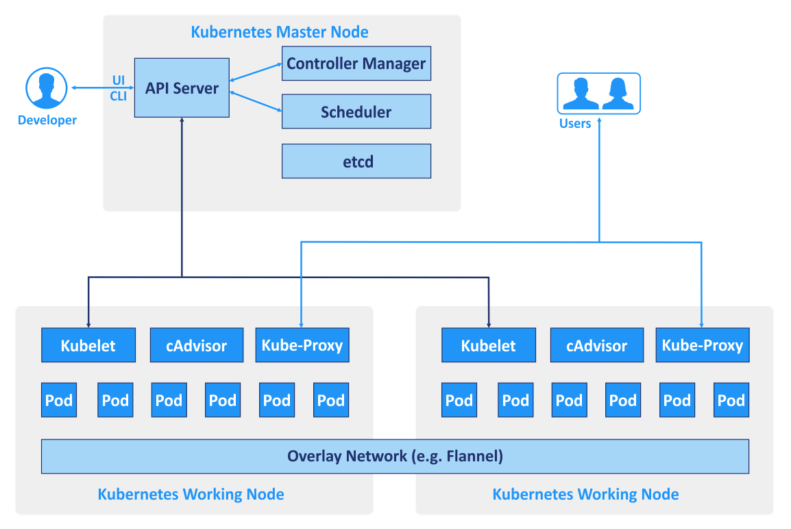
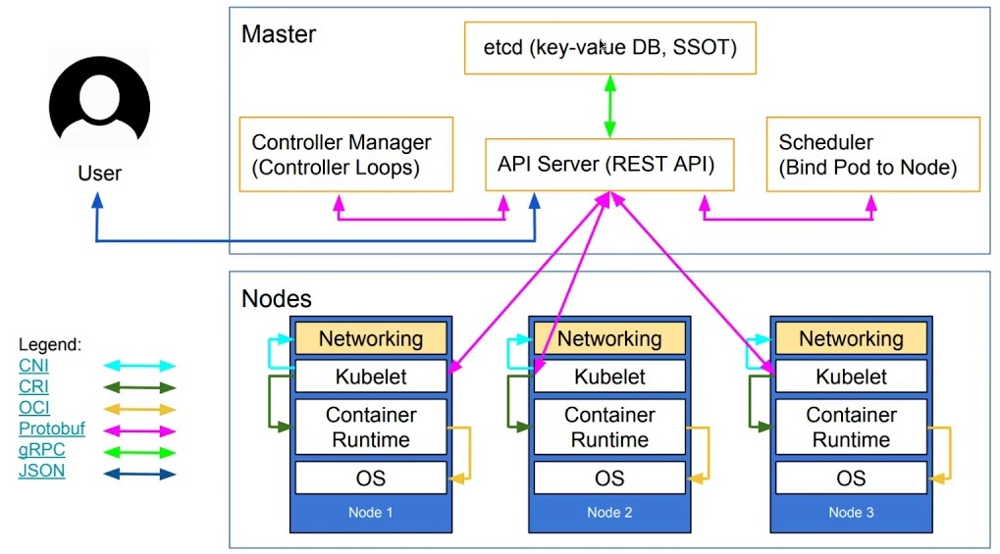

# k8s заметки


Мои конспекты по куберу. Описал своими словами, могут быть ошибки или неточности
Ссылка на официальную документацию [kubernetes.io](https://kubernetes.io/docs/home/)

Ниже представлена галерея архитектуры с разных сайтов, суть одна визуализация разная






## Компоненты мастера (master node)
### API Server (kube-scheduler)
Основная шина взаимодействия и точка входа для всех запросов. Аутентификация, валидация (линтер)

### Scheduler (kube-scheduler)
Определяет на какой worker ноде создать новый под, в зависимости от требуемых ресурсов и занятости нод. Смотрит и проверяет нагрузку на ноды, по оределенной логике определяет куда назначить под

### Controller (kube controller manager)
Проверяет состояние кластера по API (через kube-api) в etcd. Демон который включается в себя группы контроллеров. Занимается созданием и обслуживанием linux name-space.

Контролируют разные ячейки типо deployment, replicaset, pod. Например если удалить под, а вышего него есть replicsate, deployment с желаемым состоянием под удалится, controller manager видит желаемое состояние ячеек и поднимет новый под.

### Etcd
База данных (хранилище ключ-значение). Хранятся все манифесты, текущее состояние, желаемое состояние. Любая сущность описанная в yml. Для работы необходим кворум (нечетное количество). Один master — один etcd, поэтому для отказоустойчивости желательно иметь 3 мастер ноды. В некоторых случаях выносят за пределы мастера в отдельный кластер БД.

## Компоненты ноды Node (worker node)
### Pod
Базовая сущность k8s, которая группирует контейнеры между собой. Внутри может содержать несколько контейнеров ( контейнеры находятся в одном namespace шарят между собой loopback интерфейс)

### Kubelet
Бинарник, основной компонент k8s существует на каждой worker ноде кластера. Проверят API сервер на предмет описания новых подов, смотрим принес ли controller что нибудь новое, если есть изменения пытается применить их. Например смотрит на новые ноды которые должны быть развернуты на своей ноде. (который назначает scheduler (положил в etcd))

После того как привел к нужному состоянию передает информацию в API сервер. Также сообщает постоянно о состояних подов

### Kube-proxy
Представляет собой контейнер, аналог ривер прокси, отвечает за пересылку и проксирование запросов к уже существующим сервисам или приложениям, в приватной сети самого кубера, по умолчанию использует ipvs (аналог iptables оптимизированный для k8s).

### Optionals Addons
Дополнительные плагины такие как RBAC, kalico (CNI),  

## Сущности
### Deployment -> Replicaset -> Pod
Поле kind — сущности представлены и описаны в виде yaml файлов. Записываем то состояние к которму k8s должен привести. (Мы не описываем как наливать чай, а просто говорим какую кружку, какой чай, какого цвета, какой температуры и т.д. нужен как в ansible)

В yaml файл записывают минимальный необходимый набор описаний, остальное докидывает controller

Deployment — набор сценариев который порождает другую сущность replicaset ( а он своб очередь другую сущность pod)

```yaml
apiVersion: apps/v1
kind: Deployment
metadata:
  name: nginx-deployment
  namespace: name-space
spec:
  selector:
    matchLabels:
      app: nginx
  replicas: 5
  template:
    metadata:
      labels:
        app: nginx
    spec:
      containers:
      - name: nginx
        image: nginxdemos/hello:0.2
        ports:
        - containerPort: 80
        livenessProbe:
          httpGet:
            path: /
            port: 80
        readinessProbe:
          httpGet:
            path: /
            port: 80
        resources:
          limits:
            cpu: "0.5"
            memory: 128Mi
          requests:
            cpu: "0.5"
            memory: 128Mi
```

### Service
Используется для доступа к подам.

В моем понимании ClusterIP сервис работает как виртуальный IP для доступа к подам и проброса портов внутри кластера, т.к. к IP адресам подов нет смысла подвязываться
А тут имеем статичный сервис который по лейблам сам направит на нужный под.
Так же там по умолчанию выполняется балансировка нагрузки по round-robin

```yaml
apiVersion: v1
kind: Service
metadata:
  name: nginx-service-cluster-ip
  namespace: name-space
spec:
  selector:
    app: nginx
  ports:

- port: 80
    targetPort: 80

---
apiVersion: v1
kind: Service
metadata:
  name: nginx-service-nodeport
  namespace: name-space
spec:
  type: NodePort
  selector:
    app: nginx
  ports:

- port: 80
    targetPort: 80
    nodePort: 30000
```

## Пробы (Probes)
Нужны для проверки работоспособности контейнера. Проверкой проб занимается kubelet. Интересная статья про пробы хабр

Их существует три вида:

- Startup
- Liveness
- Readiness

### Startup probe
Производит проверку при старте контейнера, если контейнер запустился без ошибок и его процесс по PID живой значит проверка прошла успешно

### Liveness probe
Выполняется постоянно

### Readiness probe
Производит проверку при старте контейнера, если контейнер запустился без ошибок и его процесс по PID живой значит проверка прошла успешно

### Дополнительно про пробы
Производит проверку при старте контейнера, если контейнер запустился без ошибок и его процесс по PID живой значит проверка прошла успешно

## Пример запроса в API сервер
kubectl если отправляем какой нибудь манифест на создание пода например:

kubectl applay -f test.yml -n name-space
Запрос проходит аутентификацию, валидацию и передает информацию в etcd.

Scheduler через API сервер смотрит изменения etcd, видит что пытаются создать новый под, определяет ноду куда можно его засунуть и отправляет эту информацию в API сервер, а API сервер записывает в etcd

Controller manager в это время контролирует все это добро. Сморит тип kind создает ячейки внутри etcd

Дальше kubelet на соответствующей ноде видит информацию в etcd, что на него хотят загрузить под и пытается это сделать через CRI и результаты и сам процесс через API сервер сообщает в etcd.
